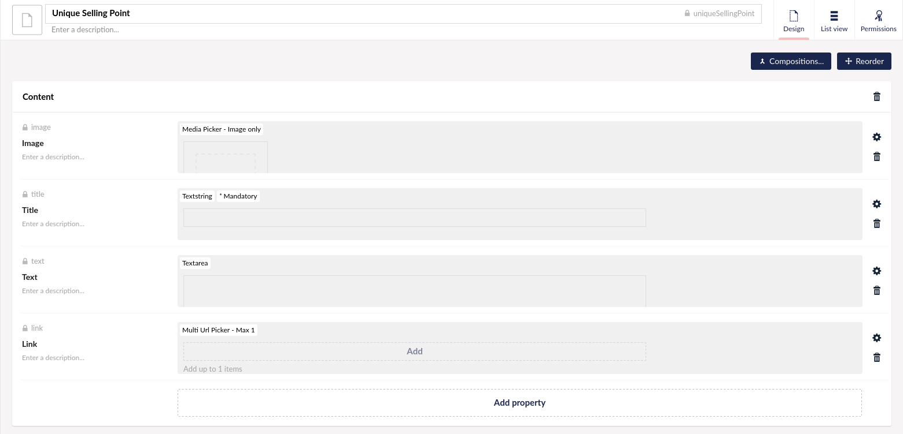
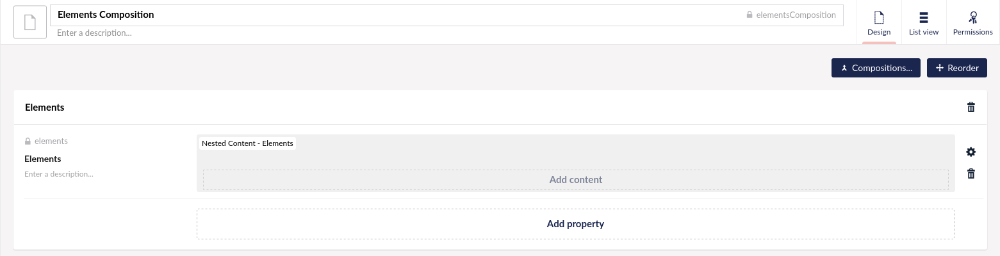
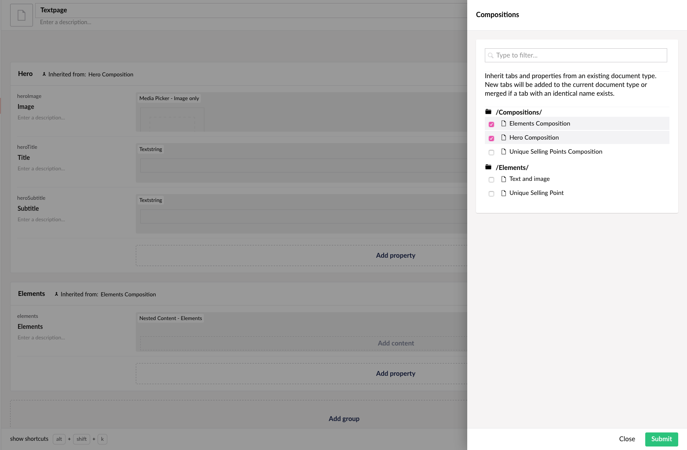
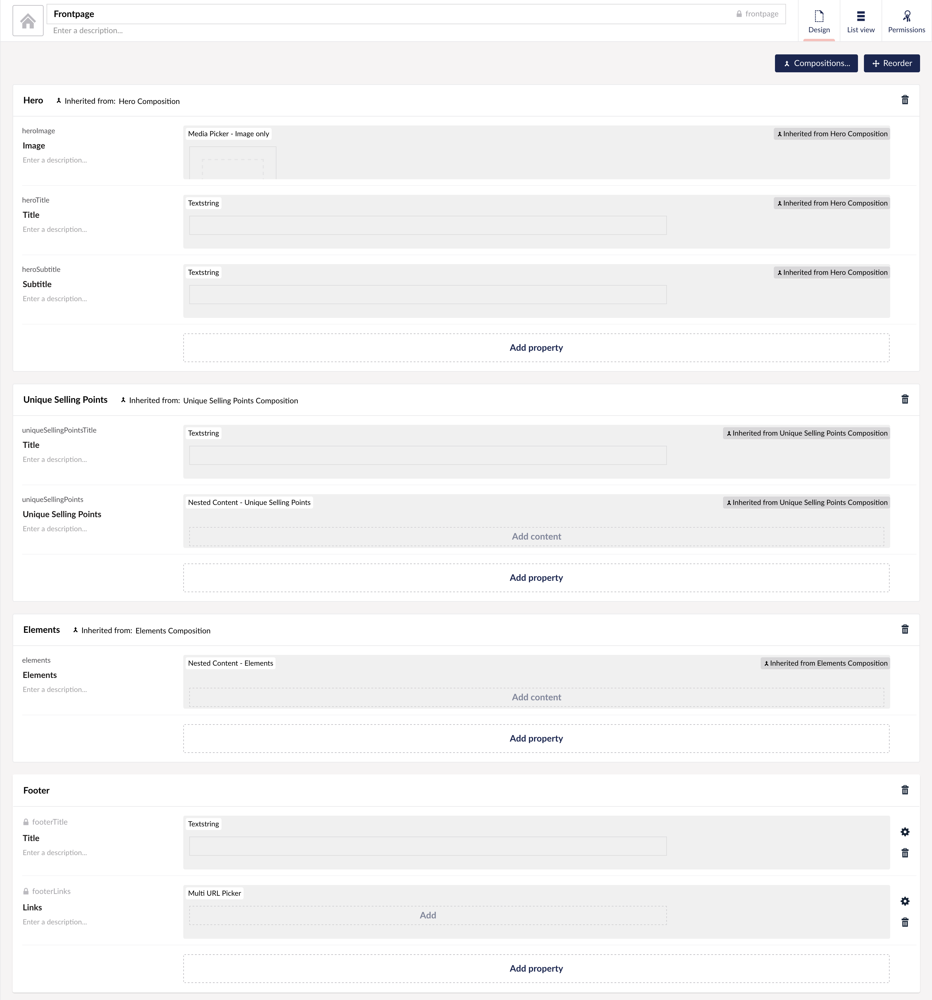
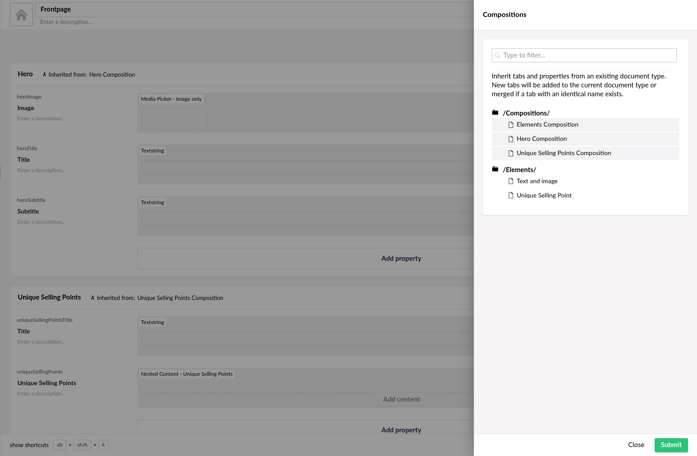
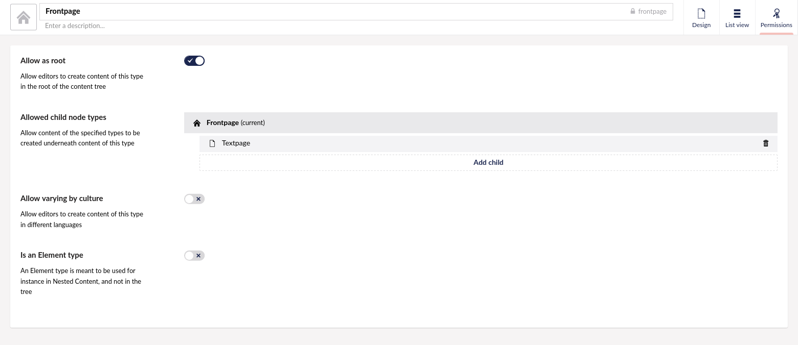

# Querying Umbraco Heartcore with GraphQL

In this tutorial we will be looking at how we can fetch data from Umbraco Heartcore using GraphQL.

We will be using https://demo.heartcore.dev/ as a reference.

At the end of the tutorial we should be able to use the Umbraco Heartcore GraphQL API and be able to fetch all the content needed to render the page in with a single query.

## Creating the Document Types

First, we will need to create some Document Types, and as a start, we will create some element types.

Start by creating a folder named **Elements** under the **Document Types** folder in the Settings section of the Backoffice.

In that folder create the following Document Types:

### Text and Image

**Alias**: textAndImage


Add a new group called **Content** with the following properties:

<table border="0">
<col width="130">
<col width="400">
<tr align=left><th>Name</th><th>Alias</th><th>Property Editor</th><th>Property Editor Configuration</th></tr>
<tr valign=top><td>Title</td><td>title</td><td>Textstring</td><td>Use defaults</td></tr>
<tr valign=top><td>Text</td><td>text</td></td><td>Rich Text Editor</td><td>Use defaults</td></tr>
<tr valign=top><td>Image</td><td>image</td></td><td>Media Picker</td><td>Pick multiple items: not checked<br>Pick only images: checked<br>Disable folder select: checked</td></tr>
<tr><td>Show large image</td><td>showLargeImage</td valign=top></td><td>Checkbox</td><td>Use defaults</td></tr>
</table>

Then under permissions check **Element Type**

### Unique Selling Point

**Alias**: uniqueSellingPoint



Add a new group called **Content** with the following properties:

<table border="0">
<col width="130">
<col width="400">
<tr align=left><th>Name</th><th>Alias</th><th>Property Editor</th><th>Property Editor Configuration</th></tr>
<tr valign=top><td>Image</td><td>image</td></td><td>Media Picker</td><td>Pick multiple items: not checked<br>Pick only images: checked<br>Disable folder select: checked</td></tr>
<tr valign=top><td>Title</td><td>title</td><td>Textstring</td><td>Use defaults</td></tr>
<tr valign=top><td>Text</td><td>text</td></td><td>Textarea</td><td>Use defaults</td></tr>
<tr valign=top><td>Link</td><td>link</td></td><td>Multi Url Picker</td><td>Max number of items: 1</td></tr>
</table>

Then under permissions check **Element Type**

---

Then create another folder called **Compositions** and create the following Document Types in that folder:

### Elements Composition

**Alias**: elementsComposition



Add a new group called **Elements** with the following properties:

<table border="0">
<col width="130">
<col width="400">
<tr align=left><th>Name</th><th>Alias</th><th>Property Editor</th><th>Property Editor Configuration</th></tr>
<tr valign=top><td>Elements</td><td>elements</td><td>Nested Content</td><td>Document Types:<br>Element Type: Text and image, Group: Content, Template: {{title}}<br>Confirm Deletes: checked<br>Show icons: checked<br>Hide label: checked</td></tr>
</table>


Then click the **Reorder** button and change the value for **Elements** from `0` to `15`


### Hero Composition

**Alias**: heroComposition


Add a new group called **Hero** with the following properties:

<table border="0">
<col width="130">
<col width="400">
<tr align=left><th>Name</th><th>Alias</th><th>Property Editor</th><th>Property Editor Configuration</th></tr>
<tr valign=top><td>Image</td><td>heroImage</td><td>Media Picker</td><td>Pick multiple items: not checked<br>Pick only images: checked<br>Disable folder select: checked</td></tr>
<tr valign=top><td>Title</td><td>heroTitle</td><td>Textstring</td><td>Use defaults</td></tr>
<tr valign=top><td>Subtitle</td><td>heroSubtitle</td><td>Textstring</td><td>Use defaults</td></tr>
</table>

### Unique Selling Points Composition

**Alias**: uniqueSellingPointsComposition


Add a new group called **Unique Selling Points** with the following properties:

<table border="0">
<col width="130">
<col width="400">
<tr><th>Name</th><th>Alias</th><th>Property Editor</th><th>Property Editor Configuration</th></tr>
<tr valign=top><td>Title</td><td>uniqueSellingPointsTitle</td><td>Textstring</td><td>Document Types:<br>Use defaulst</td></tr>
<tr valign=top><td>Unique Selling Points</td><td>uniqueSellingPoints</td><td>Nested Content</td><td>Document Types:<br>Element Type: Unique Selling Point, Group: Content, Template: {{title}}<br>Confirm Deletes: checked<br>Show icons: not checked<br>Hide label: checked</td></tr>
</table>


Then click the **Reorder** button and change the value for **Elements** from `0` to `20`


---

At the root create the following Document Types:

### Textpage

**Alias**: textpage


Click on **Compositions** and select **Elements Composition** and **Hero Composition**



### Frontpage

**Alias**: frontpage



Add a new group called **Footer** with the following properties:

<table border="0">
<col width="130">
<col width="400">
<tr align=left><th>Name</th><th>Alias</th><th>Property Editor</th><th>Property Editor Configuration</th></tr>
<tr valign=top><td>Title</td><td>footerTitle</td><td>Textstring</td><td>Use defaults</td></tr>
<tr valign=top><td>Links</td><td>footerLinks</td><td>Multi Url Picker</td><td>Use defaults</td></tr>
</table>

Then click on **Compositions** and select **Elements Composition**, **Hero Composition** and **Unique Selling Points Composition**, click on **Submit**.



On the permissions tab check **Allow at root** and add **Textpage** to the **Allowed child node types** property.



Then go to the **Content** section and create a new Frontpage with the name **Home** and create some subpages.

## Querying the GraphQL API

The GraphQL endpoint accepts `POST` requests with the content type `application/json`, the body should be an object containing as a minimum a `query` property, e.g.

```json
{
  "query": "..."
}
```

For the rest of this tutorial the GraphQL queries are written in plain text that can be executed with the [GraphQL Playground](../../Getting-Started-Cloud/GraphQL-Playground/).

Lets start with a basic query that fetches the `name`, `url`, and `heroTitle` properties from the Frontpage.

```graphql
{
  frontpage(url: "/home/") {
    name
    url
    heroTitle
  }
}
```

Result:

```json
{
  "data": {
    "frontpage": {
      "name": "Home",
      "url": "/home/",
      "heroTitle": "Umbraco Heartcore"
    }
  }
}
```

### Making the Query Generic

Up until now, we have been working on a single document type which in most cases is fine, but since we want to dynamically fetch content based on the url we can use the `content` field.

The `content` field returns the Content interface type that contains the default fields. To allow us to query the fields on the derived types we can use fragments.

A fragment allows us to query data on the underlying concrete type.

```graphql
{
  content(url: "/home/") {
    name
    ... on Frontpage {
      heroTitle
      heroSubtitle
      heroImage {
        url(width: 1980, height: 430, cropMode: CROP)
      }
    }
  }
}

```

This returns the following JSON:

```json
{
  "data": {
    "content": {
      "name": "Home",
      "heroTitle": "Umbraco Heartcore",
      "heroSubtitle": "Umbraco Heartcore is a headless CMS by Umbraco. With Heartcore, you can use the Umbraco backoffice to manage content and media that's ready to be displayed on any device.",
      "heroImage": {
        "url": "https://media.umbraco.io/demo-headless/8d832c5cee78cf8/umbraco-heartcore-preview.png?mode=crop&width=1980&height=430&upscale=false"
      }
    }
  }
}
```

The query is fetching the `name` field which exists on the `Content` interface, it also fetches the `heroTitle`, `heroSubtitle` and `heroImage` on the `Frontpage` type.

Since the `heroImage` is a Media picker we can pass arguments to the `url` field telling the server to generate an url with the [Image Cropper](../../API-Documentation/GraphQL/Schema-Generation/#ImageCropper) query string parameters.

### Querying Composition Fields

There is one problem with our query though. Try changing the `url` argument to a subpage and see whats happening.

As you can see we don't get any data back for the hero fields, even though our Document Type has those fields. This is because we are telling GraphQL that we only want them on the `Frontpage` type. You might be tempted to fix this by adding another fragment on the `Textpage` type which would work, but remember we created a Document Type that only contains hero fields which we have added as a Composition to both the `Frontpage` and `Textpage` Document Types. We can change the `... on Frontpage` fragment to `... on HeroComposition` and we will now get the expected data back.

Now our query looks like this:

```graphql
{
  content(url: "/home/") {
    name
    ... on HeroComposition {
      heroTitle
      heroSubtitle
      heroImage {
        url(width: 1980, height: 430, cropMode: CROP)
      }
    }
  }
}
```

### Querying Nested Content

Since Nested Content is an interface named `Element` we can query the fields by the specific type using fragments.

```graphql
{
  frontpage(url: "/home/") {
    elements {
      ... on TextAndImage {
        title
        text
        showLargeImage
        image {
          small: url(width: 320, height: 240, cropMode: CROP)
          medium: url(width: 480, height: 360, cropMode: CROP)
          large: url(width: 1024, height: 768, cropMode: CROP)
        }
      }
    }
  }
}
```

Now try to write a query that fetches the `title`, `text`, `link` and `image` fields for the Unique Selling Points property.

### Quering the Main Navigation and Footer

The only thing we are missing now to be able to render the complete page is the main navigation and the footer.

The main navigation is showing the children of the frontpage, we can fetch them with the following query:

```graphql
{
  frontpage(url: "/home/") {
    children {
      edges {
        node {
          name
          url
        }
      }
    }
  }
}
```

The footer can be fetched using the following query:

```graphql
{
  frontpage(url: "/home/") {
    footerTitle
    footerLinks {
      name
      target
      type
      url
    }
  }
}
```

We can even combine the two queries into a single query:

```graphql
{
  global: frontpage(url: "/home/") {
    mainNavigation: children {
      edges {
        node {
          name
          url
        }
      }
    }
    footerTitle
    footerLinks {
      name
      target
      type
      url
    }
  }
}

```

In the query above we are also using field aliases, this means that in the response data `frontpage` will be named `global` and `children` will be named `mainNavigation`.

```json
{
  "data": {
    "global": {
      "mainNavigation": {
        "edges": [
          {
            "node": {
              "name": "What is a Headless CMS?",
              "url": "/home/what-is-a-headless-cms/"
            }
          },
          {
            "node": {
              "name": "What you get with Umbraco Heartcore",
              "url": "/home/what-you-get-with-umbraco-heartcore/"
            }
          }
        ]
      },
      "footerTitle": "About Umbraco",
      "footerLinks": [
        {
          "name": "Umbraco Website",
          "target": "_blank",
          "type": "EXTERNAL",
          "url": "https://umbraco.com/products/umbraco-heartcore"
        },
        {
          "name": "Umbraco Heartcore Documentation",
          "target": "_blank",
          "type": "EXTERNAL",
          "url": "https://our.umbraco.com/documentation/Umbraco-Heartcore/"
        }
      ]
    }
  }
}
```


### Using Variables

You might have noticed that the `url` argument is hardcoded in the query. This means that we will always get back the Content for that url. What we want is to pass the argument to the query dynamically.

We can do this by altering the query to include a variable instead of the hardcoded value, this can be done by replacing the argument with `$url` and wrapping the query with `query($url: String)`.

```graphql
query ($url: String!){
  content(url: $url) {
    name
    ... on HeroComposition {
      heroTitle
      heroSubtitle
      heroImage {
        url(width: 1980, height: 430, cropMode: CROP)
      }
    }
  }
}
```

And then we pass the variable in a separate JSON property called `variables`

```json
{
  "query": "...",
  "variables": {
    "url": "/home/"
  }
}
```


### Putting it all together

Now that we have all the individual parts we can combine it all into a single query that fetches all the data needed to display the pages on our site:

```graphql
query($url: String!) {
  content(url: $url) {
    ...Hero
    ...UnigueSellingPoints
    ...Elements
  }
  global: frontpage(url: "/home/") {
    mainNavigation: children {
      edges {
        node {
          name
          url
        }
      }
    }
    footerTitle
    footerLinks {
      name
      target
      type
      url
    }
  }
}

fragment Hero on HeroComposition {
  heroTitle
  heroSubtitle
  heroImage {
    url(width: 1980, height: 430, cropMode: CROP)
  }
}

fragment Elements on ElementsComposition {
  elements {
    ... on TextAndImage {
      title
      text
      showLargeImage
      image {
        small: url(width: 320, height: 240, cropMode: CROP)
        medium: url(width: 480, height: 360, cropMode: CROP)
        large: url(width: 1024, height: 768, cropMode: CROP)
      }
    }
  }
}

fragment UnigueSellingPoints on UniqueSellingPointsComposition {
  uniqueSellingPointsTitle
  uniqueSellingPoints {
    ... on UniqueSellingPoint {
      title
      text
      link {
        name
        target
        type
        url
      }
      image {
        url
      }
    }
  }
}
```

Variables:

```json
{
  "url":"/home/"
}
```
