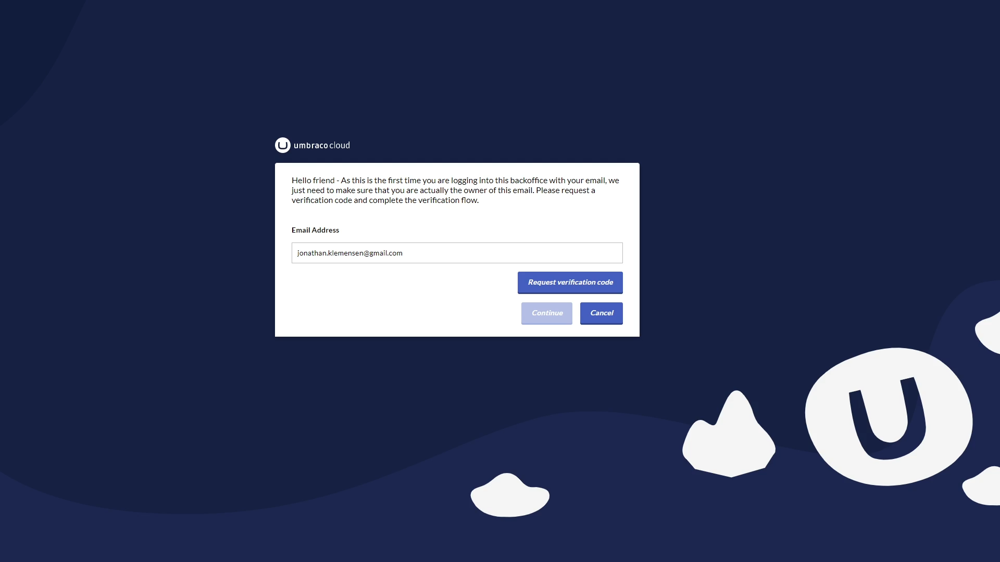
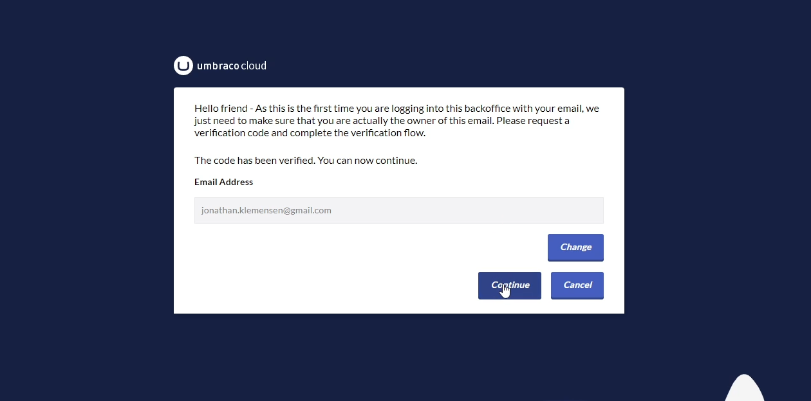

# Single-Sign-On for Umbraco Heartcore

As of May 24, 2022, all Umbraco Heartcore projects have been migrated to use UmbracoID for single sign-on. The first time you log in to your Umbraco Heartcore project, after the upgrade, there are a few steps you need to take.

## How to verify your User after the UmbracoID Migration

Once you log in to your Umbraco Heartcore project after the migration, you will be redirected to a central login page.

Before verifying your user, make sure that you have the username and password ready.

If you have saved your password in your browser, make sure to find it by using the browser-specific guides:

- [Chrome](https://support.google.com/chrome/answer/95606?hl=en&co=GENIE.Platform%3DDesktop)

- [Firefox](https://nordpass.com/blog/view-edit-delete-saved-passwords-firefox/)

- [Safari](https://support.apple.com/en-us/HT211145)

:::warning
It is not possible to reset your password when going through the verification process - this is why it is key that you know the password beforehand.
:::

### Steps on how to log in the first time

Once you are ready follow the steps below:

1. Go to the backoffice of your Umbraco Heartcore project, which will redirect you to a central login page.
2. Enter your email and password and click sign in:

3. Request a verification code which will be sent to your email address

4. Enter the verification code and press verify

5. Click continue once the code has been verified. 

You are now done and will be redirected to the backoffice of your Umbraco Heartcore project.

When the steps are completed your backoffice user has been migrated to Umbraco ID and single sign-on is enabled. This means that the login for all your projects will be centralized with one login through Umbraco ID for all your projects, Cloud and Heartcore, and the Umbraco Cloud portal.
