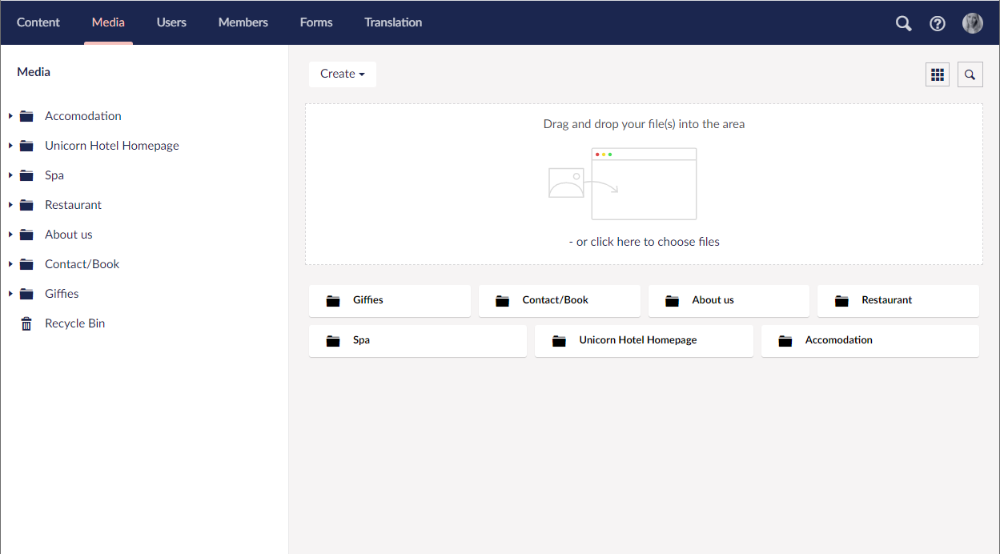

# Manage Media library

All images, video clips and files that are uploaded to your Umbraco Uno website, can be managed from the Media section in the Umbraco Backoffice. Here you can upload more media items as well as sort and edit the existing items.

## Uploading media items

Media items can be uploaded while working with content in the Content section, or directly through the Media section, which is also often refered to as the **Media Library**.

In the Media Library there are multiple different ways to upload media items. These are the two most commonly used ones:

1. Drag and drop files or folders directly into the upload field on the Media dashboard
2. Use the "Create" button in the top-left corner to create a new File, Folder og Media item

The "drag and drop" area is available in every folder in the Media section, which enables you to upload media items exactly where you need them.

## 

## Supported media types (file types)

### Images

### Files

:::tip

### Unsupported types

* `ashx`, `aspx` and `ascx`
* `config` files
* HTML files such as `html`, `cshtml`, `xhtml`, `htm` and `vbhtml`
* `asmx`
* `air`
* `axd`
* `swf`
* `xml`
* `php`
* `htaccess`

:::
