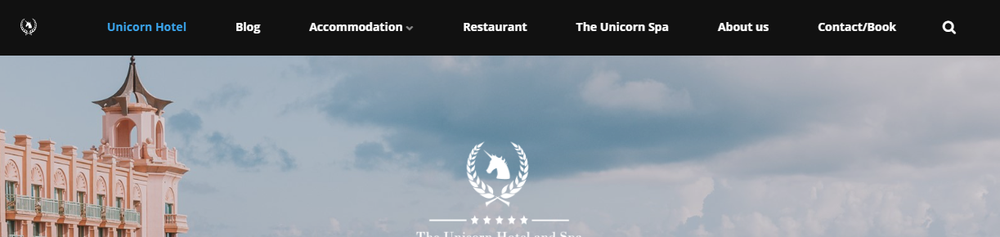

# Navigation menu

Every piece of content you create directly under the *Start node* on your Umbraco Uno website, will automatically be added to the default navigation menu. Do you have content items with sub-pages, these will be added as a dropdown in the menu.

The navigation menu will be visible at the top of the page as part of the **Header**. On the Theme settings page there are a few different layout options. These are also available through the [Theme Editor](../../Getting-Started/Themes).

In some cases, you might want to make changes to the automatically created navigation menu. This can be done by using the **Custom navigation** feature. Get a more details introduction to the configuration options for both the navigation menu and for the Header in general on the [Start node](../../Uno-pedia/Content-Types/Site-Start/#navigation) article.

In this article you will get a guide on how you can costumize the default automatically generated navigation menu and add more elements as buttons and icons.

## Custom navigation

The following guide will give you a walk-through on how you can create a
