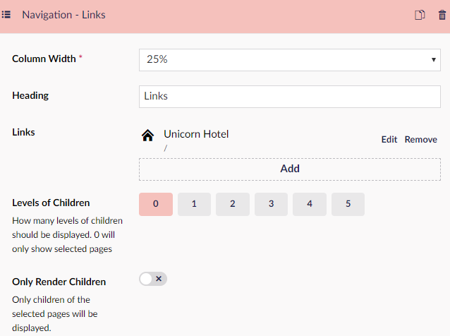
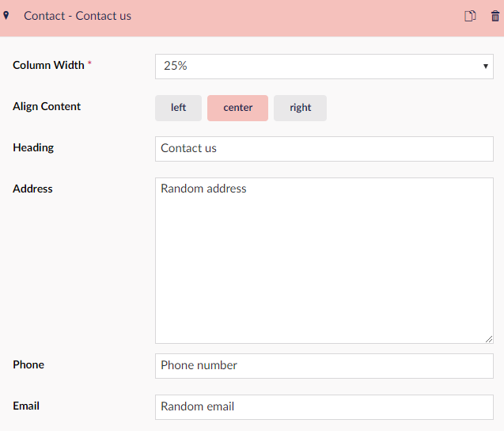

# Set-up your footer

In this guide you will learn to set up a nice looking footer.

1. Go to the backoffice
2. Click you node
3. in the workspace scroll to the bottom and find the section called footer
4. In the field saying “Footer Columns” click “Add Content” this will give you 7 options of content
5. Let’s start by adding Navigation
    - Click Navigation in the list
    - Set column width to 25% as 100% would be the entire width of the page.
    - Choose a heading for your navigation list, let’s call it links for now.
    - Next got to the field called “Links” and select “Add” then a window pops out on the right -hand side.
    -Navigate to the part of the window that says “ Link to page” if this is a clean install you will have the options of Unicorn Hotel or Global Content, If you have created a page you can select that one, however, if that is not the case lets create a link to Unicorn Hotel, we do that by clicking the text, that will mark the field with a green checkmark, finalize by clicking submit.
    - Next, we get the option to select children, which is another layer of links. we won't need this for now.
    - The final button here is "Only Render Children" this would make the node only display the child links not the main links.

        

6. Now we click "Add content" again
7. Let's add your opening hours click "Opening Hours"
    - Choose "Column Width" 25%.
    - Align Content Center.
    - Choose a Heading.
    - Under opening hours click "Add Content".
    - Write down your open days like so: Mon-Fri
    - Fill in the time slots fx 08:00-20:00

        

8. Choose "Contact".
    - Set the "Column Width" to 25%.
    - Choose Align "Left".
    - The Heading could be Contact us.
    - Then you can add your Address in the text field.
    - The next option is to add your phone number
    - Lastly is the option to add your email.

        

9. Click "Add content".
10. for our final piece of content in the footer choose "Social Links".
    - Set "Column Width" to 25%.
    - Align Content Left
    - Heading could be something like "Find us at:"
    - Add the URLs for your Social media pages

        

11. Click "Save" or "Save and publish".
12. The last option is to add some bottom text the could be a copyright text or something along those lines.

