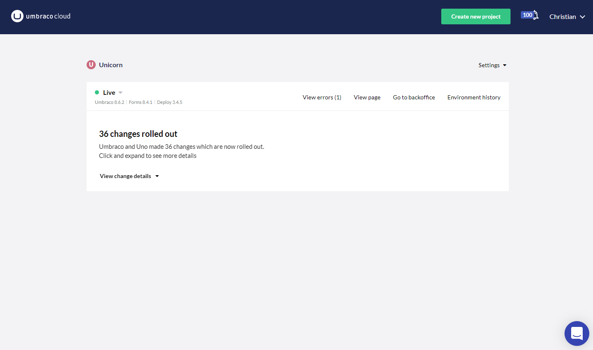

# The Portal Landingpage

While everything related to content and media is handled throught the Umbraco Backoffice, it is from the Portal Landingpage that you assign hostnames to your website, configure the general access to your website as well as toggling debug mode.

In this article you will get a full overview on how to navigate the Portal Landingpage, as well as which features the page offers.

## Environment overview

The main thing you will see on the Portal Landingpage is the environment overview of the **Live** environment, which is where your website is hosted.

The overview provides

* Details about latest changes to files (not content)
* Details about which versions of the three main products the website is using and
* A set of links to various parts of the website:
  * **View page** will send you to the frontend of the website
  * **Go to backoffice** will direct you to the Umbraco Backoffice and
  * **Environments history** will give you an overview of all changes ever made to website

By clicking on the environment name, you will also find options to toggle debug mode and restart the environment.

## Settings

Besides the environment overview, the Portal Landingpage also provides a set of additional options, all of which can be found on in the **Settings** menu.

The menu consists of the following options:

* **Hostnames** where you manage hostnames/domains for your website
* **Public access** which gives you the option to toggle whether the website should be publicly accessible or only available to the ones with a login
* **Upgrade plan** gives you both overview of the plans and the option to upgrade
* **Rename project** provides you with the option to give you Umbraco Uno project a new name
* **Delete project** gives you the option to delete the website
