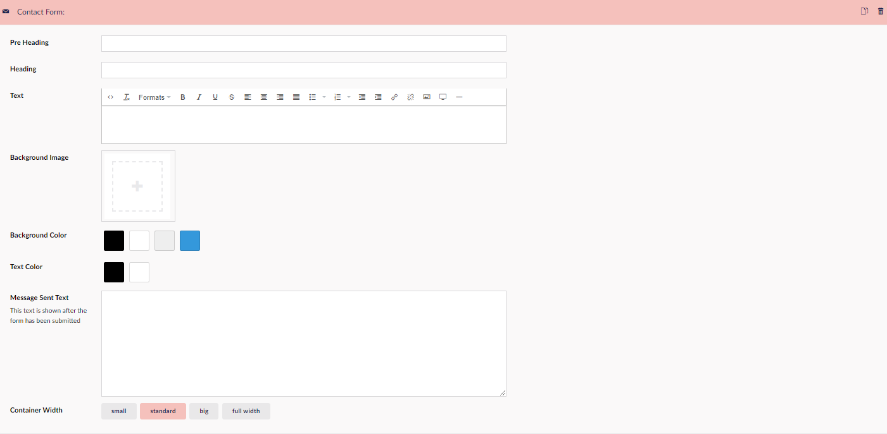

# Contact form

The Contact Form Widget will let you add a basic contact form to your project. To make it work you will need to set up a contact email.
You set up the contact email by going to the  [General Settings](../../Settings/General-Settings/) node, and fill out the ***Contact Form Email*** field.
You will need to set up [SMTP](../../../../Umbraco-Cloud/Set-Up/SMTP-settings/) for this to work aswell.

## Sample

## Configuration options

- Pre Heading
- Heading
- Text
- Background Image
- Background Color
- Message Sent Text
- Container Width

