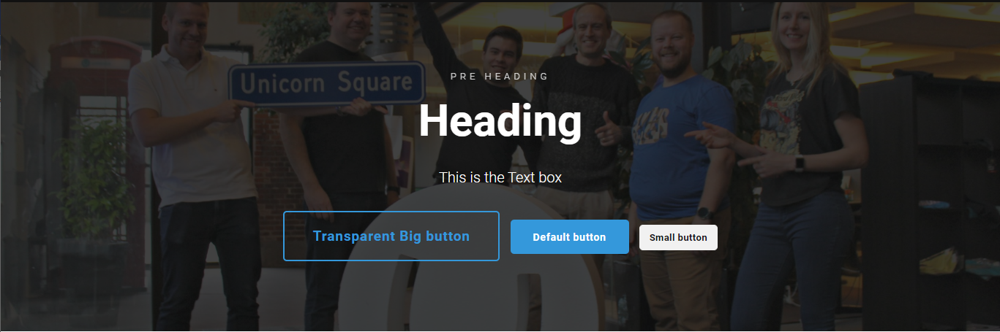

# Hero widget

The Hero Widget allows you to create a hero element on your page, this includes features such as a heading, a rich text editor, a background image and the option to add buttons.

You will have a lot of settings for your ***Hero Widget***, letting you customize the widget to your liking. This widget is ideal for content on the start page.

Below you can see an example of how a ***Hero Widget*** might look. This contains the ***Pre Header***, ***Heading***, ***Text*** and different types of ***Buttons***

## Sample

## Configuration Options

- Pre Heading
- Heading
- Text
- Background
- Text Color
- Container width
- Text Width
- Height
- Overlay Strenght
- Text Alignment
- Vertical Text Alignment
- Animate
- Buttons

