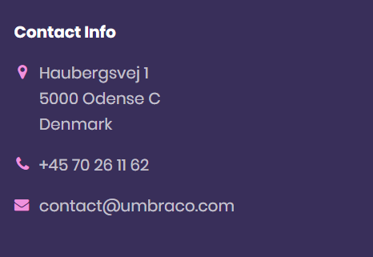

# Contact (widget)

The Contact widget is a smaller version of the Map widget and it is only available in the Footer section of the website, which can be setup from the **Start** page.

## Sample

## Configuration options

### Footer options

* Column width
* Align content
* Heading

### Contact options

* Address
* Phone
* Email
