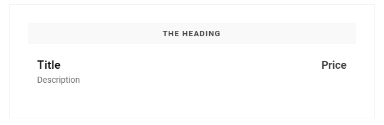

# Price List

The Price List lets you create a list of items with a title, description, and price of the items.
The way it works is that you click the add content button next to items, then fill out all the fields, and then you will have the items for your price list.

Here you can see what the front end could look like.

 

Here you can see what it could look like in the backoffice.

The options of the Price List are as follows:

- Column Width (This is mandatory because it decides how large the column containing the Price list is)

- Heading (This lets you create a heading for your Price List)

- Boxed Column (This switch adds a box around the entire Price List columns width)

- Items (This is where you create the items in your Price List)
