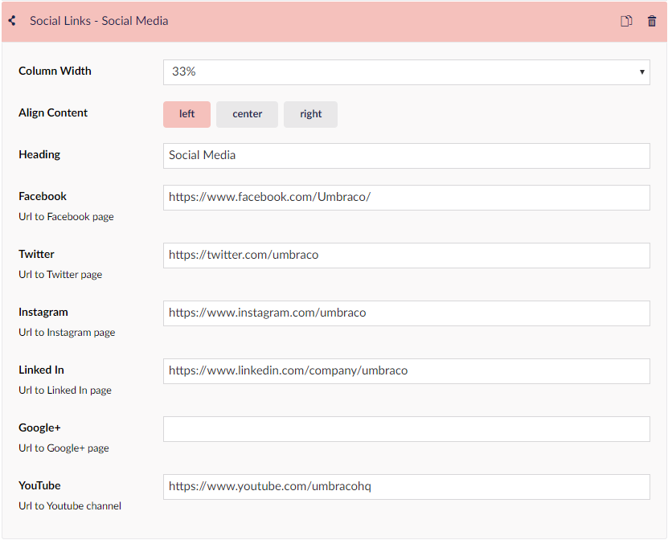

# Social links

This widget is one of the widgets that can only be added in the Footer section of the website. It provides the option to add links to profiles on various social media platforms. Each link will be added with an icon represented the social media.

## Sample

## Configuration options

### Footer options

* Column width
* Align content
* Header

### Social links options

* Facebook
* Twitter
* Instagram
* LinkedIn
* Google+
* Youtube

