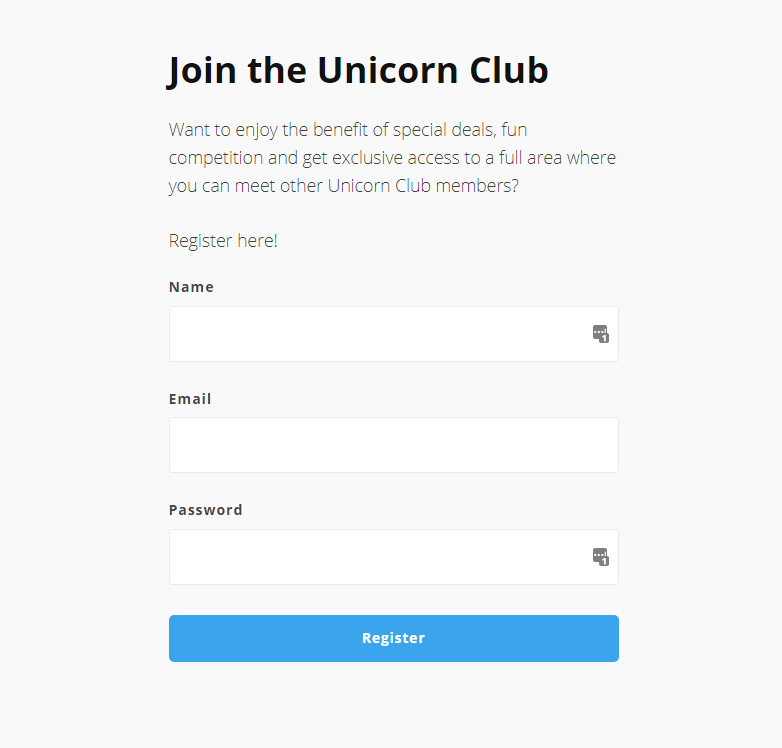
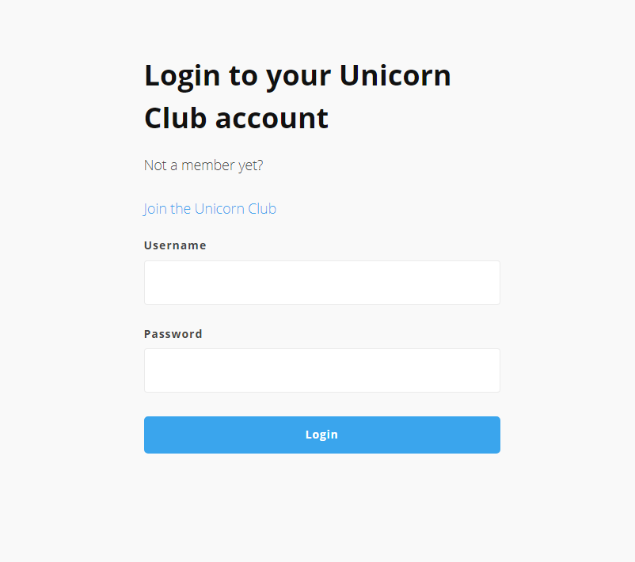
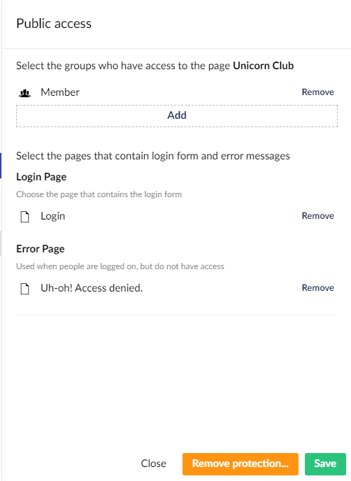
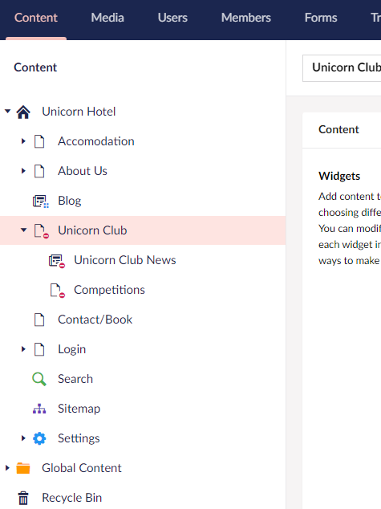
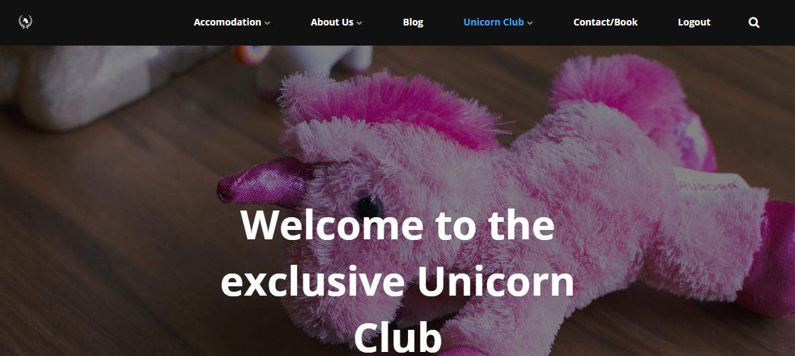

# Creating an area for members

One of the many features provided with a Umbraco Uno project is the option to create an area on your website which is only accessible to people who are logged in as members.

Creating an area for members requires a few components and involves several steps.

In this article, you will find all the information needed, in order to allow people to register as members on your website and have access to an exclusive area when they are logged in.

The article will cover:

* [Creating a registrations form](#creating-a-registration-form)
* [Creating a login form](#creating-a-login-form)
* [Setting up the member-area](#setting-up-a-member-area)
* [Adding a "Logout" button](#adding-a-logout-button)

This article will not cover how to add and manage members on your website. For more details on these topics, read the [Members](../../Manage-users/Members) article.

## Creating a registration form

The very first thing that needs to be set up is a form where people can register to become members on your website. This can be done using the [Register widget](../../Widgets/Login-and-register/#register).

1. Select the page where you want to place the Register widget - or create a new page and add the widget.
2. Find and select the Register widget from the Widget calatog.
3. (Optional) Add a heading and some text that will be displayed above the registration form.
4. Write a message to be displayed once a member has successfully registered - "Success Message Heading" and "Success Message Text".
5. Select "Confirm" to add the Register widget to the page.

:::center

:::

:::note
The Register widget has a set height of 100%. This means that the widget will always be the same height as the browser window - with a minimum height equal to the height of the registration form itself.

To change this, you will need to [enabled Custom Code](../../Custom-Code).
:::

## Creating a login form

Once the registration form has been added, it is time to add a form where registered members can log in to access the exclusive area, which will set up later in this guide.

The form to login to the site will be created using the [Login widget](../../Widgets/Login-and-register/#login).

:::tip
It is recommended that a new page is created for the Login widget.

When the Login widget is added to a page, it will have a height of 100% and the page will automatically be scrolled down to show the Login widget, no matter what other widgets are used on the page.
:::

1. Create a new page for the login form.
2. Find and select the Login widget from the Widget catalog.
3. (Optional) Add a heading and some text that will be displayed above the login form.
4. Choose which page you want to redirect the members to once they have successfully logged in.
    * If you haven't created a landing page for your members-area yet, use any page for now and make a note about updating this link once a landing page has been created.
5. Select "Confirm" to add the Login widget to the page.

:::tip
In some cases, visitors on your website might end up on your login page without being a registered member. It can therefore be a good idea to add a link to the registration form in the text above your login form.
:::

:::center

:::

## Setting up the member-area

The member-area is the area on your website that should only be accessible to members who are logged in. The area can contain any sort of information that you want. You can add Pages, Feeds, and Posts to your member-area.

If you haven't already added the pages that will make out the member-area on your website, it is recommended that you do that before moving on to the steps below. You can find information and a guide on how to create a new landing page on your Uno website in the [How to set up a landing page](../How-to-Set-Up-Landingpage) article.

Once you have a least one page for your member-area, follow the steps below to set up restrictions on who can visit the page(s).

1. Locate the page your member-area in the Content tree in the Umbraco backoffice.
2. Right-click the page to open the action menu.
3. Select **Public Access** from the action menu.
4. Choose between protection based on specific members or Member Groups.
    * Learn more about the different options for protection in the tip below these steps.
5. Click "Next" at the bottom.
6. Choose which members or groups should have access to the member-area - based on what you chose in step 4.
7. Select "Add" under *Login Page* to choose the page where you placed the login form.
8. Select "Add" under *Error Page* to choose which page should be displayed if a member without access to the member-area tries to view the page.
9. Save the Public Access configuration.

:::tip

### Choosing the right protection level

When you are configuring public access on one of your pages on your website, you will need to choose which protection level you want to use. In order to help you choose, you can find a description of each option here.

#### Specific members protection

Choose this option when you want to manually control who has access to the member-area on your website.

Members will not automatically have access to the member-area when they create a member-account using the registration form. They will need to be given access to the section. Only an administrator of a website can grant new members access to a specific member-area. Who has this access can be configured in each User Groups permission settings. Learn more about User Groups in the [Users](../../Manage-users/Users) article.

#### Group based protection

Choose this option when you want to grant an entire Member Group access to the member-area on your website.

All new members that register on your website through the registration form will be added to the "Member" Member Group. By configuring the public access on your member-area to be protected on a Member Group basis, you can choose to grant the "Member" Member Group access. Doing this will give all members on your website access to the member-are.

An administrator or other user with access to manage members on your website will be able to remove and/or add members to different Member Groups. They will also be able to create new Member Groups if needed.

:::

You should now see that the page you've configured with the public access restriction has a little red icon next to it in the Content tree. This means that the page is now restricted and only members who fit the protection level you configured, will be able to see the page. The same goes for any subpages below this.

:::center

:::

:::tip

### Disabling a member-area

In some cases, you might want to remove the restrictions added by Public Access to an area of your website.

This can be done, by right-clicking the page which is restricted by Public Access and then choose the option to **Remove protection...**.

Once you confirm, every visitor will have access to the page, as well as any subpages.

:::

## Adding a "Logout" button

Now that you have configured a member-area on your website, and also made sure that people can register for a membership and log in to view the restricted section, there is only one step left.

There needs to be an option for logged-in members to logout again. This will be done by adding an additional item to the navigation menu of the website.

1. Open the homepage (default: "Unicorn Hotel") in the Content section of the Umbraco backoffice.
2. Locate the **Navigation** group.
3. Make sure that **Display Logout If Logged In** option is checked.
4. Save and publish the homepage.

When a member is logged into your website, they will now see an option on the right side of the navigation menu to logout.

:::center

:::
