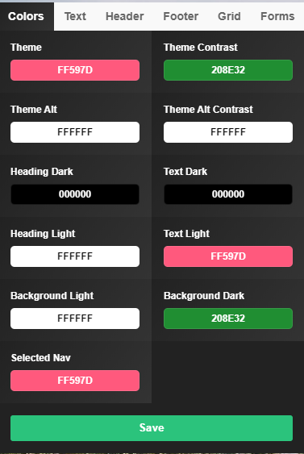

# Customize your theme

A custom theme lets you add a little personal touch to your page - the colors you want, the font, and all that. If you are new to working with Umbraco Uno and do not yet know how to work with the theme then it is recommended that you [checkout the Theme Editor.](../../Getting-Started/Themes/index.md)

## How to customize your theme through the theme editor

We will be working with the theme editor, which you can access by **previewing** any page on your website.

### Picking the colors and text of the theme

First what we will need to do, is click the green button that looks like a paintbrush - then the theme editor will show up.
The theme we will be setting up will be a watermelon theme, and it will look like this:

:::note
If you want to use colorful background colors it is recommended that you do not configure the *Overlay Strength* feature on your widgets, as the colors will be used for the overlay.
::::

1. Type in the values you see on this image below or choose your own color scheme.

    

2. Select ***Text*** in the menu bar at the top of the theme editor.
3. Choose Roboto as both Heading and Body Font

### Setting up Header and Footer

Firstly navigate to the Header tab in the theme editor, then follow the process below:

1. Set Theme Dark
2. Set Nav Position Left
3. Set Container to Full Width
4. Height should be 60
5. Height Mobile should be 50
6. Logo Padding should be left at 20
7. Logo Padding Mobile should be set to 16
8. Nav Padding set to 30
9. Nav Padding Small Screen 15

Then navigate to the Footer tab:

1. Choose Dark Theme
2. Select Container Big

## Logo

To set up the logo we will have to go back to the backoffice, navigate to settings and find Theme.
In the General tab, you will be able to set the logo you want to show on the respective themes.
The Logo will be displayed in the the header of the page, and have two differnet logos for the dark and the light theme is recomended. it is also recommended that you use png files for the logo.
