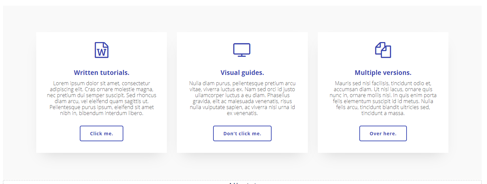

# How to set up a landing page

This is a guide designed to help you make a set up and configure a landing page for your website.

Below is a preview of how the completed landingpage will look.

In each step, one feature will be covered. It is important to note that this guide will not cover all options you will have in terms of features.

## Creating the page

- Start by right-clicking the Umbraco Hotel page in the Content tree
- Choose Create and select **Page**
- Name your new page and click **Save**

The landing page has now been created, and you are ready to start adding content.

## Adding a Hero widget

We will start by adding a greeting to our page. This will be done using the Hero widget, as it allows for having text on top of an image.

- In the Content group of your page, navigate to the Widget section and click ***Add content***
- Select the **Hero** widget
- Fill in the 3 text fields on the **Content** tab
- Choose an image to be used as the background
- Select the **Settings** tab in the top-right corner

Use the following configuration:

|Setting                |Value           |
|-----------------------|----------------|
|Text color             |White           |
|Container width        |Full width      |
|Text width             |50%             |
|Height                 |50%             |
|Overlay                |70%             |
|Text alignment         |Center          |
|Vertical Text Alignment|Center          |
|Animate                |Checked         |

Click **Confirm** in the bottom-right corner to complete the setting up and add the widget to your page.

The result should look similar to this:

## Configuring grids

Next, let's add a couple of grids which will serve as the structure for the next sections on the page.

- Click **Add content**
- Select the **Grid** widget
- Give the grid an alias - eg. "*Text and images*"

Before you start adding adding widgets to the grid, select the **Settings** tab and use the following configuration:

|Setting                |Value           |
|-----------------------|----------------|
|Container width        |Standard        |
|Remove Column Gutter   |Unchecked       |
|Compact                |Unchecked       |
|Horizontal align       |Center          |
|Vertical Align Columns |Center          |
|Background image       |None            |
|Background color       |White           |
|Text color             |Black           |
|Animate                |Checked         |

### Adding Text and Images

For this first grid we will be adding some text and images.

- Go back to the **Content** tab
- Select **Add content**
- Choose the **Text** widget
- Set the Column Width to 50%
- Add some text
- Leave the **Boxed** option unchecked
- Click **Confirm** to add the widget to the grid

Once you've added the Text widget, select **Add Content** again.

- This time, we'll select the **Image** widget
- Set the Column Width to 50%
- Choose an image from the Media library or upload a new one
- (Optional) Add a caption to the image
- Click **Confirm to add the widget to the grid

Add another Text and another Image widget, but this time, start with the Image.

Once you're done, the first grid will look something like this:

### Adding Pod widgets

Follow the steps as outlined earlier when setting up the first grid. Use the same configuration as with the first grid, but select a different background color for a more dynamic look.

In this second grid, we will be using multiple instances of the **Pod** widget.

- Go to the **Content** tab
- Click **Add content**
- Select the **Pod** widget
- Add some text to the Heading and the Text fields

Use the following configuration:

|Setting                |Value           |
|-----------------------|----------------|
|Column width           |33%             |
|Boxed Column           |Checked         |
|Center Content         |Checked         |
|Icon                   |Any             |
|Image                  |None            |
|Media Left             |Unchecked       |
|Link                   |None            |

Finally, add a button to the widget as well.

- Add some text and choose which page the button should link to
- Use the *theme color* for the button
- Make it transparent
- Use the *default* size

Click **Confirm** in the bottom-right corner to add the first pod to the grid.

We will want to add a total of 3 pods to this grid, and instead of having to set up each of these, we are going to **copy to pod we already created** and add to more. This can be done by following these steps:

- Hover the existing pod and select the **Copy** icon
- Select **Add Content**
- Navigate to the **Clipboard** tab
- Select the Pod widget
- Repeat the steps above until you have a total of **3 pod widgets** in the grid

Now you should have 3 identical pod widgets in your grid. Select each of them in turn and update the heading, text, icon and the contents of the buttons.

This should leave you with a grid that looks similar to this:

## Adding a Slider widget

Let's finalize the page by adding a more dynamic slider element to the bottom of the page, where we will slide through a set of quotes.

We will do this by using a copy of the first grid we made, and then removing all widgets from it. Alternatively you can create a new grid and use the same configuration as we used on the first grid.

- Copy the first grid on the page
- Select **Add Content** and navigate to the **Clipboard** tab
- Select the grid we copied in the first step
- Start by **deleting all Text and Image widgets from the grid**

Now you should be left with an empty grid, and we can start adding a Slider.

- Click **Add Content**
- Select the **Slider** widget

Before starting to add content, use the following configuration:

|Setting                |Value           |
|-----------------------|----------------|
|Show Next/Prev Arrows  |Checked         |
|Show Page Dots         |Unchecked       |
|Wrap Around            |Checked         |
|Autoplay               |7000            |
|Pause Autoplay On Hover|Unchecked       |
|Fade Animation         |Unchecked       |

Now, let's add some content to the slider.

- Click **Add Content**
- Select **Quote**
- Set the Column width to 100%
- Leave the **Boxed** option unchecked
- Fill in the remaining fields

Repeat the steps above at least a couple more times, to give the slider some items to run through.

:::tip
Use the **copy** feature to quickly add similar widgets without having to configure each of them every time.
:::

Once you've added the quotes you want to add, click **Confirm** in the bottom-right corner to add the slider to the grid, and again to add the grid to the page.

This was the final step of this guide. You have now setup a new landing page for your project. Feel free to play around with it and try adding other widgets to it, for a more personalized look.

## The widgets we used

If you are interested in learning more about the widgets that we used, i have collected them all below  along with a link to their article:

- [Hero](../../Widgets/Hero)
- [Grid](../../Widgets/Grid)
- [Grid: Text Widget](../../Widgets/Grid/Text)
- [Grid: Image Widget](../../Widgets/Grid/Image)
- [Grid: Pod](../../Widgets/Grid/Pod)
- [Slider Widget](../../Widgets/Slider)
- [Grid: Quote](../../Widgets/Grid/Quote)
