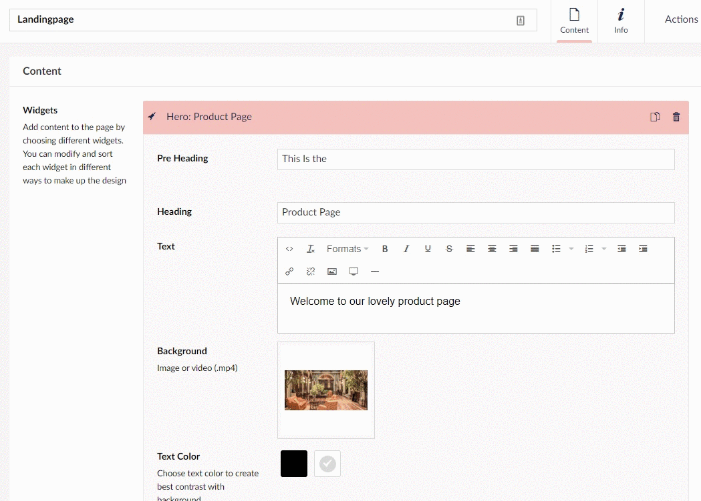

# How to set up a landingpage

This is a guide designed to help you make a nice landing page, for your website.
In each step, one feature will be covered. It is important to note that this guide will not cover all options you will have in terms of features.

The Result should look somewhat like this:

## First Step

- Start by right-clicking the Umbraco Hotel page in the Content tree
- Choose Create and select **Page**
- Name your landing page and you are ready to start creating your new landing page
- In the Content group of your page, navigate to the Widget section and click ***Add content***

## Hero

We will start by adding a greeting to our page. This will be done using the Hero widget, as it allows for having text on top of a background image in a good way.

- Pre heading: Add part of your heading here - it will be in a smaller font size above the actual Heading
- Heading: This is the main part of the heading so this will be in a larger font size
- The text will be below the heading and in a smaller font size
- Add a background image
- Choose a dark or light theme for the text depending on the colors of your image
- Container Width: Full width
- Text width: 50%
- Height: 70%
- Overlay: 60%
- Text Align: Center
- Vertical text-align: Top
- Animate turned on
- Click ***Save*** in the bottom of the page
- Go to the top of the hero and click the hero tab to minimize it

## Grid

Next, let's add a grid to be able to have a frame for how the widgets are structured.
We will be adding multiple grids to this page because the grid provides a lot of options and flexibility.

### The Text and Image Grid

We will start by making the grid:

- Click ***Add content***
- Select Grid

***Text Widget***

- Select ***Add content*** next to *Columns*
- Choose the Text widget
- Column Width: 50%
- Set a name for the item in Alias (this is for display purposes only, and will not show on the frontend)
- Add the text you want
- Toggle *Boxed* to on

***Image Widget***

- Click ***Add content***
- Select Image
- Name it in alias
- Column Width: 50%
- Select an image by clicking the +

***Grid Settings***

- Name the grid something in alias
- Container Width: Standard
- Leave these options off: Remove Column Gutter and Compact
- Horizontal align: Left
- Vertical align: Top
- Select a light color for the background
- Click ***Save*** in the bottom of the page
- Go to the top of the grid and click the grid tab to minimize it

### The Video and Price List Grid

To get started on this grid:

- Click ***Add content***
- Select Grid

***Video Widget***

- Select ***Add content*** next to *Columns*
- Pick the Video widget
- Column Width: 50%
- Pick an MP4 video file
- Hide controls: Off
- Set Autoplay to On
- Set Mute to On
- Leave Loop off
- Add a poster
- Leave video shadow off

***Price List Widget***

- Click ***Add content***
- Select the Price List widget
- Column Width: 50%
- Choose a Heading
- Leave Boxed off
- Under Items click ***Add content*** to create the list items
- Fill in the spaces of Title, Description, and Price for the item 
- Repeat this process until you have the number of items you want

***Grid Settings***

- Name the grid something in alias
- Container Width: Standard
- Leave these options off: Remove Column Gutter and Compact
- Horizontal align: Left
- Vertical align: Top
- Select a light color for the background
- Click ***Save*** in the bottom of the page
- Go to the top of the grid and click the grid tab to minimize it

## Slider Widget

Let's finalize by adding a slider element to the bottom of the page, to slide through products.

- In the Alias name the slider what you want to call it
- Next click ***Add content*** to choose what kind of content you want in the slider 
- Select the Image widget
- Give the image a name in the alias field
- Select the image you want to use by clicking +
- Next, select a small size
- Set compact to on
- Write a caption if you want to add text to the image
- Background color: Gray
- Repeat the previous steps to add more images to the slider
- Turn on Show next/prev Arrow
- Turn off Show Page Dots
- "Wrap-around" should be on for the best result
- Set Autoplay to 3000
- Pause AutoPlay should be on
- Fade Animation: Off
- Click ***Save*** in the bottom of the page
- Go to the top of the slider and click the slider tab to minimize it

## The widgets we used

If you are interested in learning more about the widgets that we used, i have collected them all below  along with a link to their article:

- [Hero](../../Widgets/Hero)
- [Grid Text Widget](../../Widgets/Grid/Text)
- [Grid Image Widget](../../Widgets/Grid/Image)
- [Grid Video Widget](../../Widgets/Grid/Video)
- [Grid Price List Widget](../../Widgets/Grid/Price-List)
- [Slider Widget](../../Widgets/Slider)
