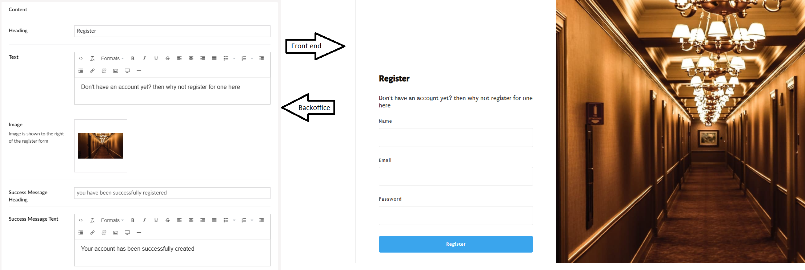
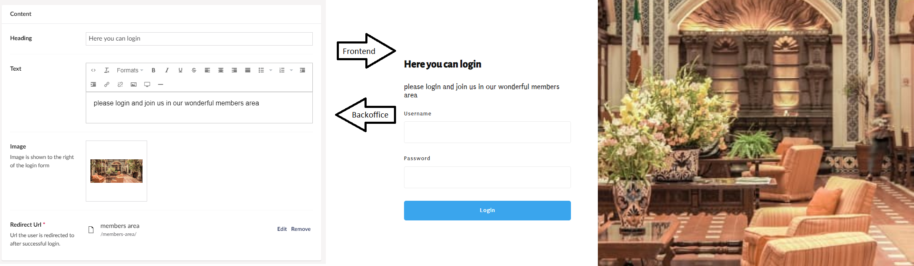

# How to set-up member area

Suppose you need an area for only select users of your page. In that case, a member area will give you exactly that, so follow this guide. You will learn everything you need to know to set up a member area that is not accessible for users that aren't registered as members.

There's going to be three parts in this guide, one to set-up register and one to set-up login, and finally one for the member's area.

## Register

We will start by setting up a Register widget.

To set-up register widget:

1. Select the page where you want the register widget to be 
2. Add the register widget
3. Fill out the settings for register widget

## Members area

A member's area could be a nice place to share inside stuff that you only want a particular group of your page users to see.

Before we create the login widget, it is a good idea to make the member's area. This is because when we are setting up the login widget, we will have to link to the page that it takes the user to after the login.

To set-up a members area:

1. Press "..." next to Unicorn Hotel/home node and choose to create a page
2. Set up the new page how you would like your member's area to look
3. To make the page members only go to the top right and press actions
4. In the actions menu, select ***Public Access***
5. In the window that shows up, you select whether its a single member or an entire group. In this guide, we will go with the group option
6. Set the login page to the page where you have the login widget
7. Finally, you can add an error page
8. Save it

## Login

Finally, we will end this guide by adding the login page.

To add the login page:

1. Select the page you want to have your login page on
2. Add the login widget and fill out every field how you like
3. In the field that says redirect URL choose the members page that you made in the previous chapter.

Now you should have a system that lets users register and login to a secluded members area.
