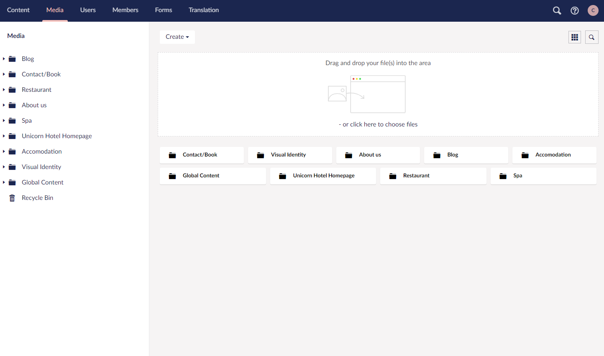

# Manage Media library

All images, video clips and files that are uploaded to your Umbraco Uno website, can be managed from the Media section in the Umbraco Backoffice. Here you can upload more media items as well as sort and edit the existing items.

## Uploading media items

Media items can be [uploaded while working with content](../Work-with-content/index.md) in the Content section, or directly through the Media section, which is also often referred to as the **Media Library**.

In the Media Library there are multiple different ways to upload media items. These are the two most commonly used ones:

1. Drag and drop files or folders directly into the upload field on the Media dashboard
2. Use the "Create" button in the top-left corner to create a new File, Folder og Media item

The "drag and drop" area is available in every folder in the Media section, which enables you to upload media items exactly where you need them.

We highly recommend that you use folders to organize your images and other media items. This is especially relevant, if you're going to add a lot of media to your website.

Read the [Folders for Media](Folders-for-media/index.md) article to learn more about how to organize your media items.

## Manage media items

For each media item on your website you can add any time change the name of the item as well as see the dimensions for it.

You can also see on which pieces of content each media item is being used. Find this feature on the "Info" tab when browsing through items in the Media Library.

## Supported types

Most of the common types can be uploaded to the Media Library in Umbraco.

### Images

Supported media types include (but are not limited to):

* `png`
* `jpg/jpeg`
* `gif`
* `svg`

### Files

Supported file types include (but are not limited to):

* `pdf`
* `doc/docx`
* `xlsx`
* `txt`

:::tip

### Unsupported types

* `ashx`, `aspx` and `ascx`
* `config` files
* HTML files such as `html`, `cshtml`, `xhtml`, `htm` and `vbhtml`
* `asmx`
* `air`
* `axd`
* `swf`
* `xml`
* `php`
* `htaccess`

:::
