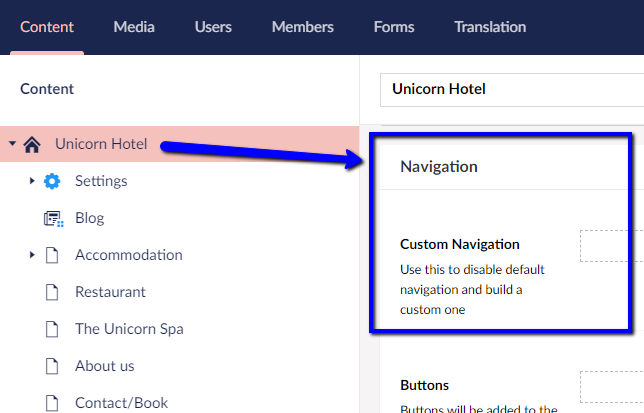
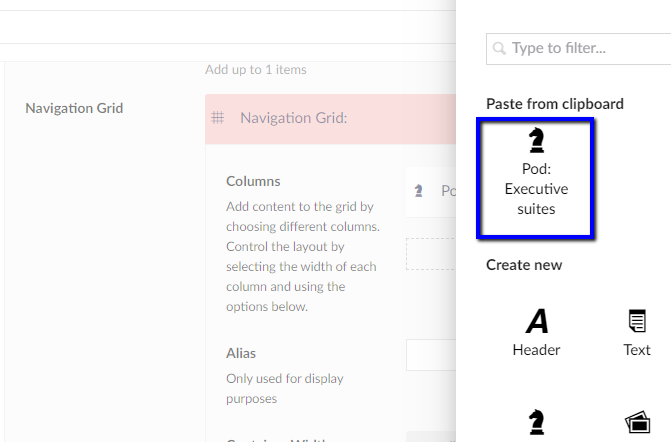
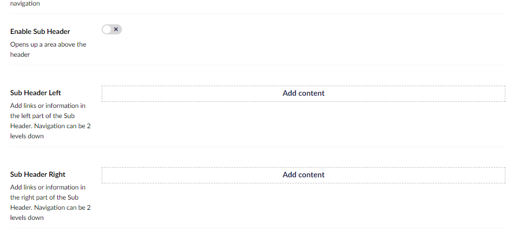

# Navigation menu

Every piece of content you create directly under the *Start* page on your Umbraco Uno website, will automatically be added to the default navigation menu. Do you have content items with sub-pages, these will be added as a dropdown in the menu.

The navigation menu will be visible at the top of the page as part of the **Header**. On the Theme settings page there are a few different layout options. These are also available through the [Theme Editor](../../Getting-Started/Themes).

In some cases, you might want to make changes to the automatically created navigation menu. This can be done by using the **Custom navigation** feature. Get a more detailed introduction to the configuration options for both the navigation menu, and the Header in general, on the [Start page](../../Uno-pedia/Content-Types/Site-Start/#navigation) article.

In this article you will get a guide on how you can customize the default automatically generated navigation menu and add more elements, like buttons and icons.

## Custom navigation and Header

The following guide will give you a walk-through on how you can create a custom navigation menu for your website. We will also be working a bit with *sub headers*.

Once complete, the new header including the navigation menu will look similar to this:

### Links and buttons

The first part of the navigation will revolve around choosing links and buttons for the navigation. This will be done from the **Navigation** group, which can be found on the *Home* page in the Content section of the Umbraco backoffice.

1. To add items to the custom navigation, click **Add Content**
2. Choose **Navigation item**
3. Give the item a name - we'll go with *Unicorn Hotel*
4. Click the **Add** option next to *Link*
5. Choose where the item should link to - for this guide, we'll choose our Home page, *Unicorn Hotel*.
6. Hit **Submit** to add the link

That was the first item in our custom navigation. If you at this point where to *Save* and *Preview* the Home page, you'll see that the navigation menu currently only has a single link; *Unicorn Hotel*.

7. Click on the name of the *Unicorn Hotel* item to *collapse it*
8. Again, we'll select **Add content** to add the next item for our navigation
9. This time we'll choose **Big Navigation**
10. We'll give it a name - *Accommodations*
11. For *Link*, we'll choose the *Accommodations* page in the Content tree (to expand the Content tree in the Link dialog, click on the little arrow next to the Home page)
12. Next up, we'll select **Add content** next to *Navigation Grid*

This is a bit different, from adding a link to the navigation. Instead we will add a box that will appear when you hover over the *Accommodation* link.

#### Big Navigation items and grids

To add this, we're going to use a Grid, which uses all the standard [Grid widgets](../../Widgets/Grid).

We'll be adding a total of **3 columns** to the Accommodation navigation item.

13. Select **Add Content** next to *Columns*
14. Choose the [Pod widget](../../Widgets/Grid/Pod)
15. Set the *Column width* to 33%
16. Choose a heading - *Executive suites*
17. Add a bit of text - for this guide, I'll be adding a bit of *Lorem Ipsum* text
18. Select **Pick an icon...** next to *Icon*, and choose the diamond icon
19. Toggle the *Media left* option to ensure that the icon will be displayed left of the content
20. Add a link to the *Effective Executive Suite* page

That was the first of the three columns. We're going to copy this first Pod widget in order to create the remaining two.

21. Copy the *Pod: Executive Suites* widget by clicking the copy-icon on the right-side
22. Click **Add Content** and choose the widget that you've copied

Once you've copied the widget twice, make sure to update the heading, text, icon and link to match the remaining two pages under Accommodations, *Family Wonderland* and *The Unicorn King*.

For the next item in our custom navigation, we're going to copy the *Big Navigation* item we created above; the *Accommodations* item.

23. Copy the **Accommodations** navigation item
24. Select **Add content** under the last navigation item and choose *Accommodations* from the clipboard
25. Update the name of the new item to **Facilities** and link it to the Home page
26. In the navigation grid for this item, we will only need two columns; one for *The Restaurant* and one for *Unicorn Spa*
27. Make sure to update heading, text, icon and link to match the two pages, *The Restaurant* and *Unicorn Spa*.

When you've setup everything you need in the *Facilities* navigation item, add a couple more item to the navigation menu.

Below the Custom navigation which we've been working with so far, there's an option to add buttons to the navigation. These will be added in the right-most side of the header. For this guide, we'll be adding a single button.

1. Click **Add content**
2. Choose a text for the button - *Book*
3. Make sure the button *links* to the *Contact/Book* page
4. Under color, choose the *Theme color* (last one on the right)
5. Choose the button size

At this point, go ahead and hit **Save** in the bottom, and select the **Preview** feature.

### Sub Headers

We've already created the custom navigation, and now we're going to extend the Header a bit. We will be doing this by adding a **Sub Header** with a few links to social media.

A bit further down in the Navigation group, you'll find the option to add sub headers.

1. Toggle to **Enable Sub Headers**
2. Click **Add content** next to *Sub Header Right* as this is where we'll be adding our social media links
3. Leave the *Name* field blank
4. Choose an icon - preferably one that represents a social media site like Twitter, LinkedIn or YouTube
5. Click **Add** next to Link
6. In the Link dialog, type in the URL for Twitter, LinkedIn or Youtube
7. Make sure to box to open link in a new window or tab i checked

8. Hit submit to add the link

Once you've completed the first item in the sub header, use the copy feature to create more, linking to other social media sites.

### Header layout

The custom navigation is almost complete at this point. 

The final thing we are going to update is a few layout things.

1. On the Home page, locate the *Settings* group
2. Toggle *Transparent Header* to make the header transparent on the frontpage
3. Under *Transparent Header Color* choose the light theme
4. Save the Home page
5. Navigate to the *Theme* settings found under *Settings* in the Content tree
6. Locate the *Header* group
7. Set the *Header Layout* to **navigation-left**
8. Hit *Save*
9. Navigate back to the Home page
10. **Preview** the page

