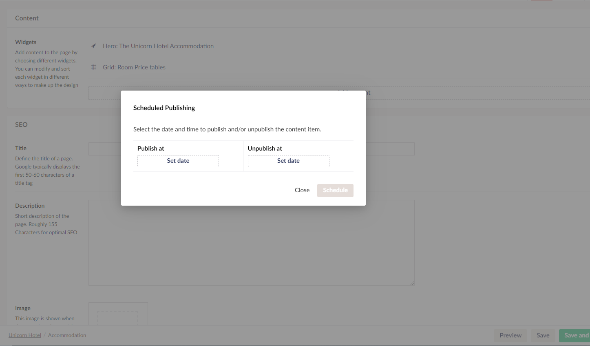

# Scheduled Publishing

Scheduled publishing lets you set a time and a date for when your page should be published. An example, could be if you have a deadline then you can set the publishing for the deadline. Then work on your page until then and then the site will be automatically published at the time and date of when it was scheduled to.

## How to setup Scheduled publishing

To set up scheduled publishing you will need to follow these steps:

1. Navigate to the page you want to publish at a predefined date and time
2. At the bottom of this page find the green button that says ***Save and Publish***
3. Next to the ***Save and Publish*** button there's an extra button with an arrow in

4. Click the arrow button and a menu shows up
5. Select ***Schedule***
6. After selecting ***Schedule*** a window shows up with two options

7. Select ***Set date*** in the ***Publish at*** section
8. Pick a date in the calendar and a time in the bottom in of the calendar
9. The page will be published at the date and time that you set

## How to setup Scheduled Unpublishing

You might want a page to be unpublished at a certain time and date, like for example an event page.

1. Navigate to the page you want to unpublish at a certain date and time
2. At the bottom of this page find the green button that says ***Save and Publish***
3. Next to the ***Save and Publish*** button there's an extra button with an arrow in
4. Click the arrow button and a menu shows up
5. Select ***Schedule***
6. After selecting ***Schedule*** a window shows up with two options
7. Select ***Set date*** in the ***Unpublish at*** section
8. Pick a date in the calendar and a time in the bottom in of the calendar
9. The page will be unpublished at the date and time that you set
