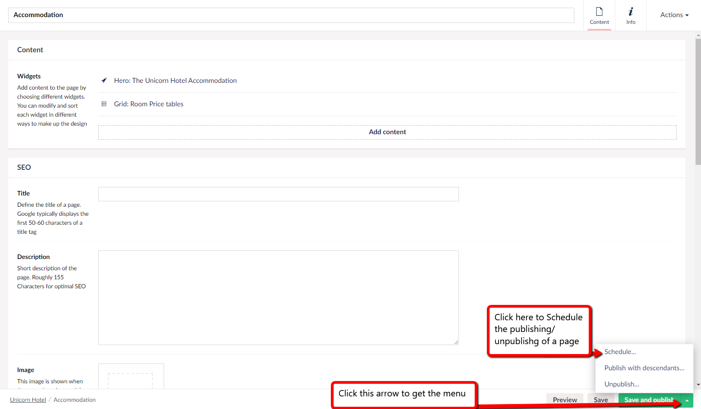

# Scheduled Publishing

Scheduled publishing lets you set a time and a date for when your page should be published. 

An example, could be if you have a deadline then you can set the publishing for the deadline. You can then work on your page until the deadline and the site will automatically be published at the time and date of when it was scheduled to.

## How to setup Scheduled publishing

To set up scheduled publishing you will need to follow these steps:

1. Navigate to the page you want to publish at a predefined date and time
2. At the bottom of this page select the arrow-button next to the ***Save and Publish*** button - this will reveal a set of additional options

3. Select ***Schedule***
4. A window with two options shows up 

7. Select ***Set date*** in the ***Publish at*** section
8. Pick a date in the calendar and a time in the bottom in of the calendar
9. Select ***Schedule*** and the page will be published at the date and time that you set

## How to setup Scheduled Unpublishing

You might want a page to be unpublished at a certain time and date, like for example an event page.

1. Navigate to the page you want to unpublish at a certain date and time
2. Follow steps 2-4 from the guide to schedule publishing above
3. Select ***Set date*** in the ***Unpublish at*** section
4. Pick a date in the calendar and a time in the bottom in of the calendar
5. The page will be unpublished at the date and time that you set

:::tip
By Clicking the Info tab ***i*** button in the top right corner, you get taken to the info dashboard and in the general section of this, line three shows what time the changes will be (un)Published.
:::