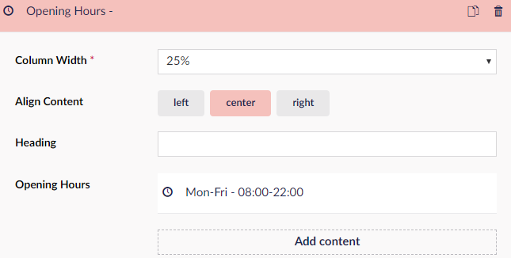
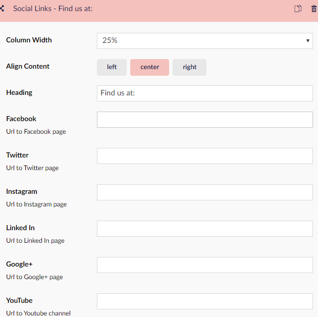

# How to set-up your Footer

It can be challenging to set-up a footer if you never tried it before. This guide will help step-by-step, to get a nice looking and informative footer for your website.
In this guide you will be introduced, to some of the features you can add to your footer, namely Navigation. Opening Hours, Contact, and Social Links.

You can set the theme for your footer by navigating to "Theme" settings under "Settings" in the Content section. Here you'll find a "Footer" group, where you can choose between dark or light theme, and you can change the container width.

This is how the footer should look after you have gone through the guide:

## The Footer

Start by doing the following:

1. Go to the Umbraco Backoffice
2. Click your home page - the first item in the Content tree
3. In the workspace scroll to the bottom and find the group called Footer
4. In the field saying “Footer Columns” click “Add Content” which will give you 7 options for content to add

## [Navigation](../../Uno-pedia/Widgets/Grid/Navigation)

Let’s start by adding Navigation.

- Click Navigation in the list
- Set column width to 25% as 100% would be the entire width of the page.
- Choose a heading for your navigation list, let’s call it links for now.
- Next go to the field called “Links” and select “Add” - a window pops out on the right-hand side.
- Navigate to the part of the window that says “ Link to page”, where you will see your entire Content tree.
- Choose an item from the tree - in this case, we'll choose "Unicorn Hotel"
- Click "Submit" to add the link
- Next, we get the option to select children, which is another layer of links. We won't need this for now.
- The final button here is "Only Render Children" which would make the page only display links to the child pages, instead of the selected one

## [Opening Hours](../../Uno-pedia/Widgets/Opening-hours)

Now we click "Add content" again. To add your opening hours click "Opening Hours"

- Choose "Column Width" 25%.
- Align Content Center.
- Choose a Heading.
- Under opening hours click "Add Content".
- Write down your open days like so: Mon-Fri
- Fill in the time slots fx 08:00-20:00

## [Contact](../../Uno-pedia/Widgets/Contact)

The next step is to add Contact to your footer.

- Click "Add Content" and choose "Contact"
- Set the "Column Width" to 25%.
- Choose Align "Left".
- The Heading could be Contact us.
- Then you can add your Address in the text field.
- The next option is to add your phone number
- Lastly is the option to add your email.

## [Social Links](../../Uno-pedia/Widgets/Social-links)

 For our final piece of content in the footer choose "Social Links".

- Click "Add content"
- Set "Column Width" to 25%.
- Align Content Left
- Heading could be something like "Find us at:"
- Add the URLs for your Social media pages

The last option is to add some bottom text. This could be a copyright text or something along those lines.
Finalize the footer by clicking "Save" or "Save and publish".
