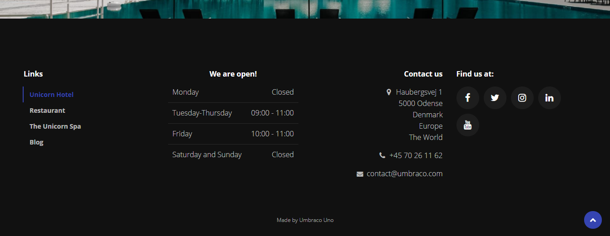
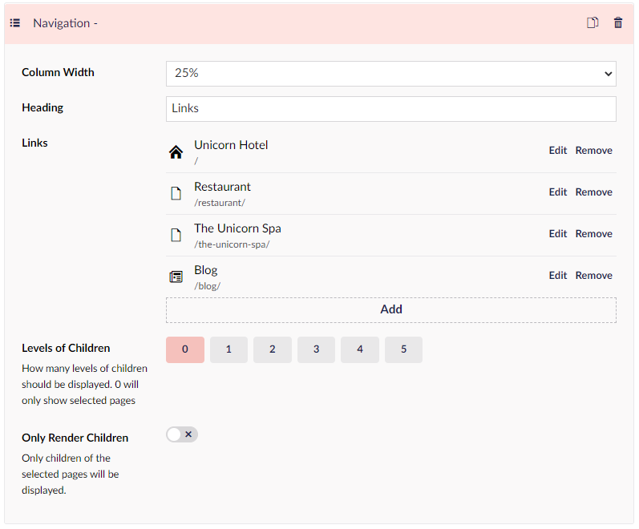
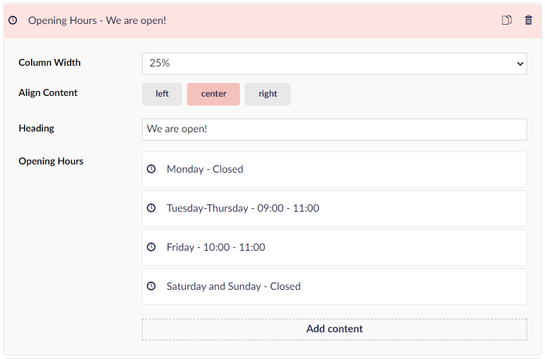
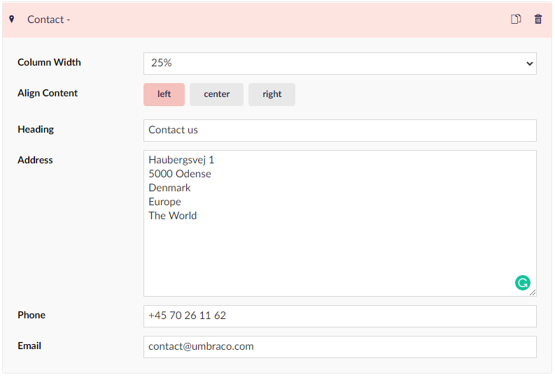
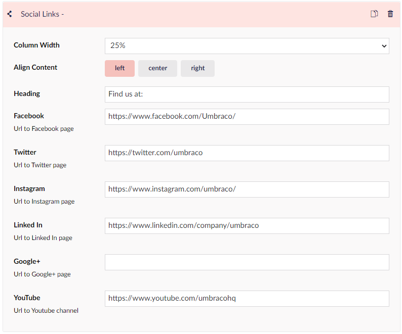

# How to set up a custom Footer

It can be challenging to set up a footer if you have never tried it before. This guide will help you set up a structured and informative footer for your website.

You can set the theme for your footer by navigating to **Theme** settings under **Settings** in the Content menu. Here you'll find a **Footer** group, where you can set a color theme and change the container width.

This is how the footer should look after you have gone through the guide:

## What widgets does footer have

Here you will find a list over the widgets available to you when working with the footer.
The list is as follows:

* Contact
* Navigate
* Text
* Opening Hours
* Social Links
* Logos
* Line Breaker
* Code

## Locating the Footer settings

The Footer settings for your Umbraco Uno website are located in a group on the home page.

- Go to the Umbraco Backoffice
- Select your home page - the first item in the Content tree
- In the workspace, scroll to the bottom and find the group called **Footer**

## Remove existing Footer content

As the *Unicorn Hotel* site already has a Footer set up, we will start this guide by deleting the existing element.

To do this, hover the **Footer Columns** text and select the ellipses (...). From the menu that pops up, select **Remove all items** and click **Delete** to confirm.

We now have a clean slate, where we can start setting up our own custom Footer.

In order to add content to the footer, click on “Add Content”. This will give us 7 options for content to add to the footer. In this guide, we will go through 4 of these.

## [Navigation](../../Widgets/Grid/Navigation)

Let’s start by adding a Navigation with some links.

- Click on **Add content** and select **Navigation** from the list
- Set column width to 25%
- Choose a heading for your navigation list
- Next go to the field called “Links” and select **Add** - a window will pop out in the right-hand side
- Navigate to the part of the window that says **Link to page** where you will see a replica of your content tree
- Choose an item from the tree - in this case, we'll choose "Unicorn Hotel"
- Click **Submit** to add the link
- Repeat the steps above to add a few more links to the navigation

## [Opening Hours](../../Widgets/Opening-hours)

Now we select "Add content" again. This time, we will be adding some opening hours.

- Select the **Opening Hours** widget
- Set the Column width to 25% again
- Align Content Center
- Choose a Heading
- Next to where it says "Opening hours", click **Add Content**
- Add a **Day** and a **Time slot** into the two fields - this can be any format, eg. numbers or words
- Add as many instances of the "Opening hours" as you need

## [Contact](../../Widgets/Contact)

The next step is to add some contact info to our footer.

- Click **Add Content** and choose the **Contact** widget
- Set the "Column Width" to 25%
- Choose Align "Right"
- The Heading could be "Contact us"
- Add your address in the text field
- The next option is to add your phone number
- Lastly is the option to add your email

## [Social Links](../../Widgets/Social-links)

For our final piece of content in the footer we will go with some links to social media.

- Click **Add content** and select the **Social Links** widget
- Set the Column width to 25%
- Align Content Left
- Heading could be something like "Find us at:"
- Add the URLs for your social media pages

The last option is to add some text to the very bottom of the page using the **Bottom Text** field. This could be a copyright text or something along those lines.

Finalize the footer by clicking "Save" or "Save and publish".

We have now created a custom footer for our website.

There are many more ways to customize the footer section and make it fit the website you're creating.
