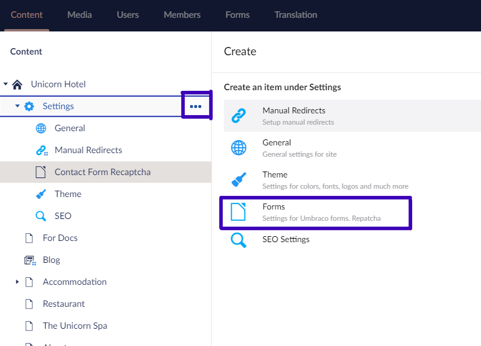

# Creating content

When you are creating content in Umbraco Uno, you will have many tools at your disposal. This page is designed to help you get started on utilizing these tools.

## Choosing the correct tools

When you want to create content, it is a good idea to think about what tools to use for the job.

An example of this could be choosing between the Image widget and the Gallery widget. The Image widget only allows you to add one image, whereas the Gallery widget will allow you to set up a gallery of images and you can also choose to only select one image with that widget

Which of these two widgets you choose to use for the job depends on what you specifically need for this situation.

There is multiple ways to approach content creation, two of these ways are explained. Both approaches use the [Grid](../Widgets/Grid) feature.

### Widget based design and structure

If you do not have a predefined design you want to follow, coming up with a design and a structure based on the possibilities of widgets is a great way to start.

The grid widget gives you all the tools you would need to create a good looking website. All of these widgets are great to work with. Making a grid is a good way to secure a good structure, and these grids can be saved in global content to keep the same look and feel throughout you website pages.

### Fitting widgets to your already existing design and structure

If you already have a predefined design you need to achieve, the grid widget is a good option.

To get started it would be a good choice, to start by setting up the grid structure in a global content page. Doing so will allow you to keep a consistent structure throughout your pages.
Keeping the grid in a global content page is both time efficient and structure efficient as you will only have to set up the core structure once.

## [Working With Content](Work-With-content/index.md)

Working with content in Umbraco Uno has many different aspects to it, which are all explained in the *Working with content* article.

## [How to create a landingpage](How-to-Set-Up-Landingpage)

Create a brand new landingpage fra scratch following our "How to create a landingpage" guide. It will provide thorough steps and introduce you to a few widgets along the way.

## [Set-up a Footer](Set-Up-Footer)

On some website the bottom is where you would go for all sorts of different information. With Umbraco Uno you can create a Footer exactly like that; with all sorts of different information.

## [Navigation-menu](Navigation-menu)

The navigation menu is an essential part of any website. With Umbraco Uno you can choose to go with the default, auto-generated one or created a custom navigation where you have full control over the contents.

## [Manage Media Library](Manage-Media-Library/index.md)

When creating content, you will most likely need to work with media as well. The article on managing the Media Library offers a good piece of insight into how you can do this best.

## [Rich Text Editor](Rich-Text-Editors/index.md)

The Rich Text Editor or RTE as people call it is a great way to create content. It is a text editor, that allows you to write longer text pieces with all the formatting options you would need.

## [Working With Widgets](Working-With-Widgets/index.md)

When you're creating content in Umbraco Uno you will primarily be working with Widgets. These allow for a work process that is very straight forward, and they can be arranged in a grid for more complexity.

For a full overview of the Widgets provided with Umbraco Uno see the [Widgets](../Widgets) section in the Uno-pedia.

## Working with Forms

Umbraco Uno ships with Umbraco Forms, which is an addon product that enables you to create forms that fit right into your existing design. You can customize the forms as you like, and depending on which type of form you're setting up, you can attach a workflow that fits.

To learn more about how to work with Umbraco Forms head over to [Umbraco Forms Documentation](https://our.umbraco.com/documentation/add-ons/umbracoforms/) to get started.

### Recaptcha and Umbraco Uno

When you're using the *Recaptcha* forms option in Umbraco Uno, you will need to follow a few extra steps, in order to configure the feature.

The steps are outlined below:

1. Open a browser and navigate to https://www.google.com/recaptcha/admin/create
2. Fill the form and submit it
3. Copy the **site key** and **secret key**
4. Head into the backoffice of your Umbraco Uno site
5. Locate the Settings page
6. Click the elipsies and choose to create an instance of **Forms**
7. Copy and paste your site key into the field called "Recaptcha public key"
8. Save and publish the Forms settings content node

