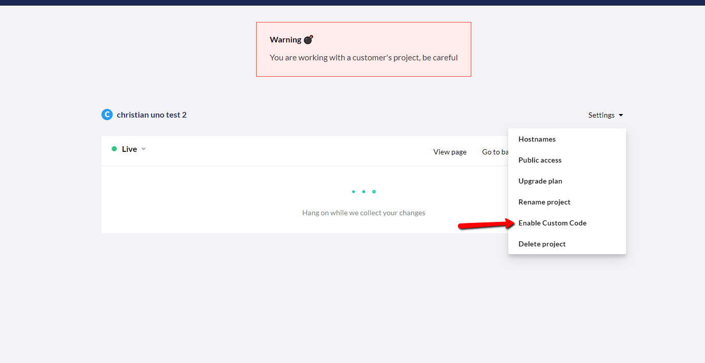
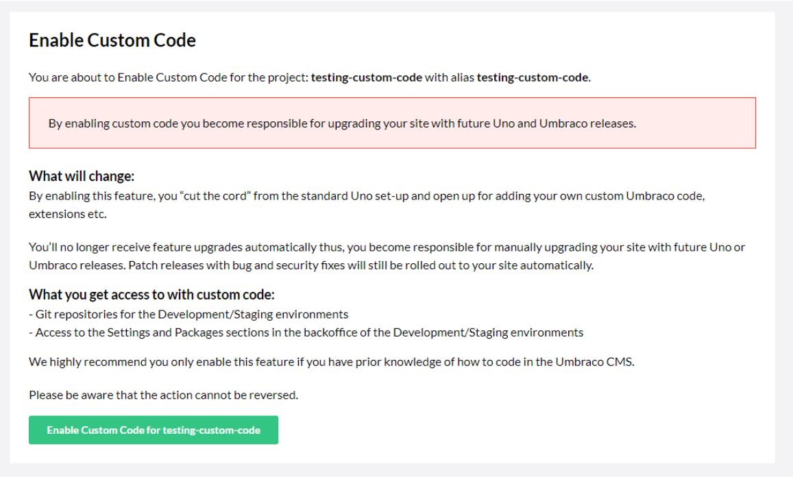

# Custom Code

In Umbraco Uno, it is possible to enable Custom Code, if you are on a Standard or Professional plan. Enabling custom code will give you the opportunity to extend on the functionality and features that Umbraco Uno provides.

:::warning
Please be aware that by enabling custom code you also agree to the following changes in your project and subscription:

* You will **no longer be entitled to Umbraco Uno support** but Umbraco Cloud support according to the subscription plan instead
* The project will **no longer receive Umbraco Uno related updates**
* The Sendgrid implementation will be removed, meaning that you will have to [manually set up your own mail integration](../../Umbraco-Cloud/Set-Up/SMTP-settings/index.md) 
:::

## Extend Umbraco Uno with more functionality

Once you've enabled custom code on your Umbraco Uno website, two new sections in the Umbraco backoffice will be available to you: Settings and Packages. These will be available on your Development and Staging environments, and not on Live.

Furthermore, you will gain access to Git for Development and Staging which will enable you to clone the environments to your local machine.

If you decide to clone your Umbraco Uno Project down locally, it is important that you use `localhost` when running the project, as changing it will lead to issues with our license checker.

:::note
Enabling custom code on your Umbraco Uno project **does not** open for the option to create a multilingual site.

We are working on adding this feature to Umbraco Uno. Please keep an eye on our [Product Roadmap](https://umbraco.com/products/roadmap/) for more details.
:::

## How to enable custom code

The way you activate this feature is very straight forward:

1. Navigate to your project in the portal

2. Go to settings

3. Select ***Enable Custom Code***

4. You will be taken to a new page with a disclaimer, telling you that once you enable custom code you cannot turn it off again.

5. If you are sure you want to enable custom code then go ahead and click the green button saying ***Enable Custom Code***

:::links
## Related articles

- [Extending Uno](../Creating-Content/Extending-Uno)

:::
