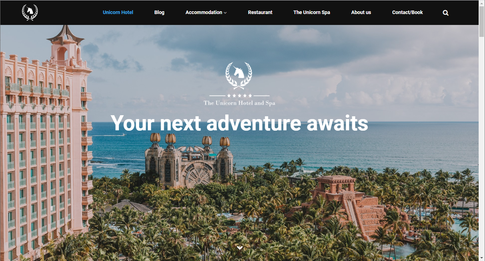
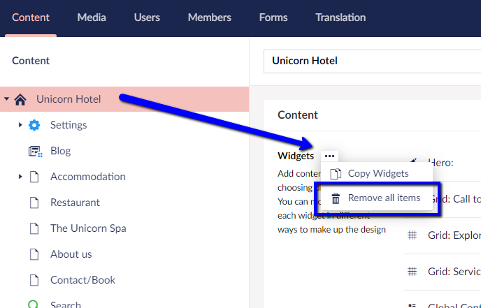

# Sample site

Most Umbraco Uno projects ships with a sample website for the imaginary **Unicorn Hotel and Spa**.

The site is created to showcase all the main features of Umbraco Uno.

The sample site contains a set of landingpages, a blog with a few entries and a contact page. It's great for testing Umbraco Uno and you're welcome to add to and play around with it.

## Starting from scratch

When you're ready to build your own website, you can take to roads:

1. Use all the existing content from the sample website, but update text and images to match your needs
2. Delete all the existing content from the sample website, and create your own from scratch.

To delete the sample website, follow these steps:

* Navigate to the Content section in the Umbraco Backoffice
* Select and open the "Unicorn Hotel" page
* Delete all widgets from the Content group

* Remove any unwanted pages
  * To delete a page, right-click it and select "Delete"

:::warning
**Important**: Do not delete the following pages:

* Settings
* General
* Theme
* Search
* Sitemap
:::

All deleted pages will be moved to the "Recycle bin" at the bottom of the Content tree. It's recommended that you empty the recycle bin, before you start working on your own website.

To empty the recycle bin, follow these steps:

1. Right-click the "Recycle bin" at the bottom of the Content tree
2. Select "Empty recycle bin..." and click "OK" to confirm the deletion

Once you've deleted all unwanted content and widgets, you can start building your own site. Start by renaming the start page from "Unicorn Hotel" to the name of your company or whatever else you want to call it.

:::note
If you want to do a more thorough cleanup, you can also head over to the Media section in the Backoffice to delete any images and media files that you do not need on your own website.

Deleting media is similar to deleting content. You can read more about it in the [Manage Media library](../../Creating-Content/Manage-Media-library) article.
:::
