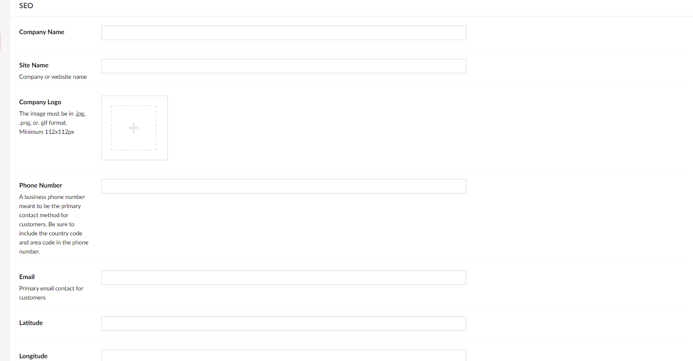
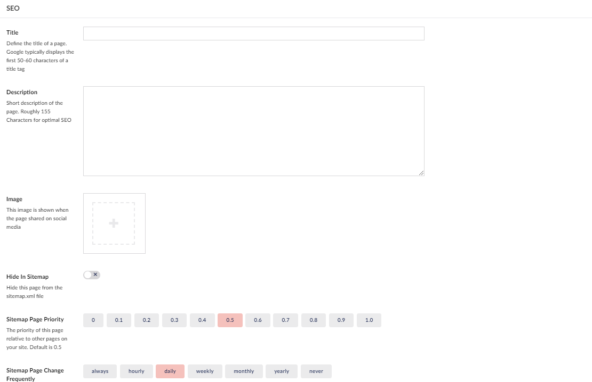

# Working with SEO
In this article, you will learn what the purpose of SEO is and how you set it up for your project.

### What is SEO

SEO or its full title "Search Engine Optimization", is exactly what it implies.
It is a method to make your website as visible as possible by trying to meet search criteria through means such as keyword optimization.

### How to set up SEO in the settings section

In the settings section, you will be setting up your company information for SEO, so that when someone searches for something related to your company your page will appear at a higher rank in the search results. You can set this up by following the guide below:

1. Click your home node in this case that would be Unicorn Hotel
2. Then go to ***settings***
3. When you are in the settings node scroll until you are at the SEO section

    

4. Fill out the fields, the more fields you have filled out the more optimized your website is.
5 Finalize by saving

Below is where the input in each of the fields is used on your site:

***Company name***
Company name is used as the image ALT text for your logo in the main navigation and in the footer.

***Site name***
Site name is added as a value to the Open Graph property "OG:site_name"

***Company logo***
Company logo is added as the "logo" property in the schema markup type "Organization".

***Phone number***
Phone number is added as a value to the Open Graph property "OG:phone-_number". It is also added as the "telephone" property in the schema markup type "Organization".

***Email***
Email is added as a value to the Open Graph property "OG:email"

***Latitude***
Latitude is added as a value to the Open Graph property "OG:latitude"

***Longitude***

### How to set up SEO on each of your pages

In the SEO section of your pages, you can optimize the factors that make this exact page show up in the search engine.
You can get tips on how to set it up in the following guide:

1. Go to one of your pages, for this guide we will use Accommodation
2. When you are there scroll until you reach the SEO section

    

3. Fill out Title and Description
4. Add an image you want to show up in the search engine
5. Chose if you want to show this page in the sitemap, in this case, we will leave it on
6. Pick the sitemap page priority, unless you want this page to be ranking higher or lower than other pages on your side, then leave this at 0.5
7. Pick how often you believe this page will be seeing changes 
8. Finalize by saving

Below is where the input in each of the fields is used on your site:

***Title***
Title is added as the title element for your page, as the value to the Open Graph property "OG:title", and the value to the Twitter property "twitter:title"

***Description***
Description is added as the meta description for your page, as the value to the Open Graph property "OG:description", and the value to the Twitter property "twitter:description"

***Image***
Image is added as the value to the Open Graph property "og:image" and the value to the Twitter property "twitter:image"

***Hide in Sitemap***
If this setting is toggled the page will be hidden in the sitemap. You can see your sitemap at domain.com/sitemap

***Sitemap Page Priority***
Sitemap Page Priority is added as the value for the sitemap property `<priority>`. 1 is highest priority and 0 is lowest priority. Priority is used by search engine crawlers as an indication for which pages you want them to prioritize when they crawl your website. 

***Sitemap Page Change Frequently***
Sitemap Page Change Frequently is added as the value for the sitemap property `<changefreq>`. This is used by search engine crawlers as an indication for which pages you want them to crawl more often than others.

