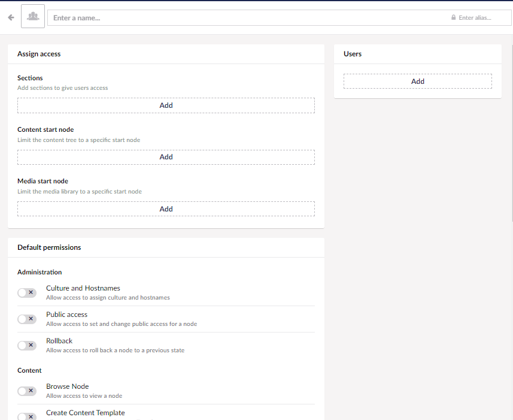

# Users

## What can you do with a user

As a user has access to your backoffice, you will need to decide what your users need to be able to do in your backoffice, this can be controlled by adding your users to the correct user groups.

## Invite a user

When it comes to adding users to your project, you will have two options in how you do so.

- Inviting a user
- Creating a user

Inviting a user lets you write the name of the receiver and their email, then you will get the option to add their user group and finalize it with a message for the receiver.

Creating a user, lets you create the user for the person and add the name and email for the user along with assigning it to a user group. You get to the create user window, by clicking the arrow down next to the "invite user" button.

The only major difference in these two options is that if you choose to invite a user they will have 72 hours to accept or the invitation becomes invalid.

<iframe width="800" height="450" src="https://www.youtube.com/embed/6WwrtptgSII?rel=0" frameborder="0" allow="autoplay; encrypted-media" allowfullscreen></iframe>

## User groups

Creating user groups can be a great way of keeping track of what users have access to in the backoffice.

The way a user group works is that you create it in the User section, then set up what these groups should have permission to access and change.
This can be achieved by entering the user group section. Hit create user, from there you will be able to create user groups, and add the restrictions for what the users, in that group will be able to do, and then you add the users to the groups accordingly.

### Adding a user to a user group

Adding a user to a user group can be done when the user is created/invited, however, you can always create more user groups, and add users to those as well.

The way you do this is to:

- Click the user in question
- When on their profile, you scroll down until you see, assign access
- In this section the first option is groups
- Here you can add or remove the user to/from any group you would like
- You can also choose a media and a content start page for the user, to limit the tree for the users.

Another and perhaps more efficient way to add users to groups is to:

- Go to the group's section
- Click the name of the group you want to add users to
- Once inside the group navigate to the right side of the screen where there is a box saying Users
- Click the "Add" button.
- Select the user you want to add
