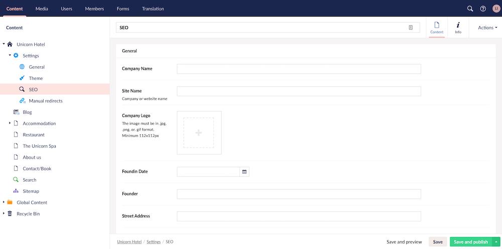

# SEO settings in Uno

In the SEO Settings, you will be setting up your company information for SEO, which increases your visibility in search results when someone searches for something related to your company.

In order to receive the best possible SEO score for your Umbraco Uno website, we recommend that you carefully fill out each of the fields on the SEO settings page..

In this article you will find a quick guide on how to setup the SEO settings page. You will also find a complete and detailed list about each of the fields, how to fill them in and where on your website each of them are used.

## How to manage the general SEO

1. In the **Content** section, expand the home page (in this case that would be ***Unicorn Hotel***)
2. Expand **Settings** and select **SEO**

    

3. Now you are presented with a list of general SEO settings that you can fill out. Fill out all relevant fields with information for your project.
4. Finalize and publish the changes by clicking **Save and publish** in the bottom-right corner

## General SEO settings explained

### Company name

This field is used to input the name of your company.

Company name is added as the `name` property in the schema markup type “Organization” that is added to the front page of your website. It is also added as the `name` property for “publisher” in the schema markup type “BlogPosting” that is added to your blog posts.

If you want to learn more about this, checkout the following resurces:

* [“Organization” schema markup](https://schema.org/Organization) and
* [“BlogPosting” schema markup](https://schema.org/BlogPosting)

### Site name

This field is used to input the name of your website. This can be the same as your company name or a name that you want to use for your website.

Site name is added as a value to the Open Graph property `OG:site_name`. Learn more about these properties on [Open Graph website](https://ogp.me/).

Site name is also added as the link title for the logo used in the top navigation bar.

### Company logo

This field is used to upload your company logo. Please note that this logo will not be visible on your website.

To set the visible logo on your website you will need to go to **Theme** under **Settings** and add your logo.

Company logo is added as the `logo` property in the schema markup type "Organization" that is added to the front page of your website.

It is also added as the `logo` property for “publisher” in the schema markup type “BlogPosting” that is added to your blog posts.

### Founding Date

This field is used to input the founding date of your company.

Founding Date is added as the `foundingDate` property in the schema markup type "Organization" that is added to the front page of your website.

### Founder

This field is used to input the name of the founder of your company.

Founder is added as the `name` property for “person” in the schema markup type "Organization" that is added to the front page of your website.

### Street Address

This field is used to input the street address of your company headquarters.

Street address is added as the `streetAddress` property for “PostalAddress” in the schema markup type “Organization” that is added to the front page of your website.

### City

This field is used to input the city where your company headquarters is located. Use the English name of the city if it is different from the local name.

City is added as the `addressLocality` property for “PostalAddress” in the schema markup type “Organization” that is added to the front page of your website.

### Postal Code

This field is used to input the postal code (ZIP code) of your company headquarters.

Postal Code is added as the `postalCode` property for “PostalAddress” in the schema markup type “Organization” that is added to the front page of your website.

### Country

This field is used to input the country where your company headquarters is located. Use the English name of the country if it is different from the local name.

Country is added as the `addressCountry` property for “PostalAddress” in the schema markup type “Organization” that is added to the front page of your website.

### Region

This field is used to input the region where your company headquarters is located. Use the English name of the region if it is different from the local name. If you’re in doubt, [here is a list of administrative divisions by country](https://en.wikipedia.org/wiki/List_of_administrative_divisions_by_country), which can be used to find the proper region.

Region is added as the `addressRegion` property for “PostalAddress” in the schema markup type “Organization” that is added to the front page of your website.

### Phone number

This field is used to input the phone number that your customers can use to reach your customer support. It is a good idea (but not mandatory) to add a country code/area code.

Phone number is added as the `telephone` property for “ContactType” in the schema markup type “Organization” that is added to the front page of your website.

Phone number is also added as a value to the Open Graph property `OG:phone-_number`.

### Email

This field is used to input the main email address that your customers can use to reach your customer support.

Email is added as a value to the Open Graph property `OG:email`.

### Latitude and Longitude

These fields are used to input the latitude and longitude for your company headquarters.

Latitude is added as a value to the Open Graph property `OG:latitude`.

Longitude is added as a value to the Open Graph property `OG:longitude`.

### Social Media

The SEO settings also includes fields for some of the most popular social medias: **Facebook**, **Twitter**, **Instagram**, **Youtube** and **LinkedIn**.

The fields are used to input the URL to your company page on each of these social medias.

Each URL is added as a `sameAs` property in the schema markup type “Organization” that is added to the front page of your website.

### Hide From Search Engines

This field is used to block search engines from crawling your website. If you wish to “hide” the page from search engines and stop them from crawling (and potentially indexing) your page, you should set this to true/on.

When "Hide From Search Engines" is set to `true`, your `robots.txt` file will be updated to include the following directive:

```xml
User-agent: *
Disallow: /
```
