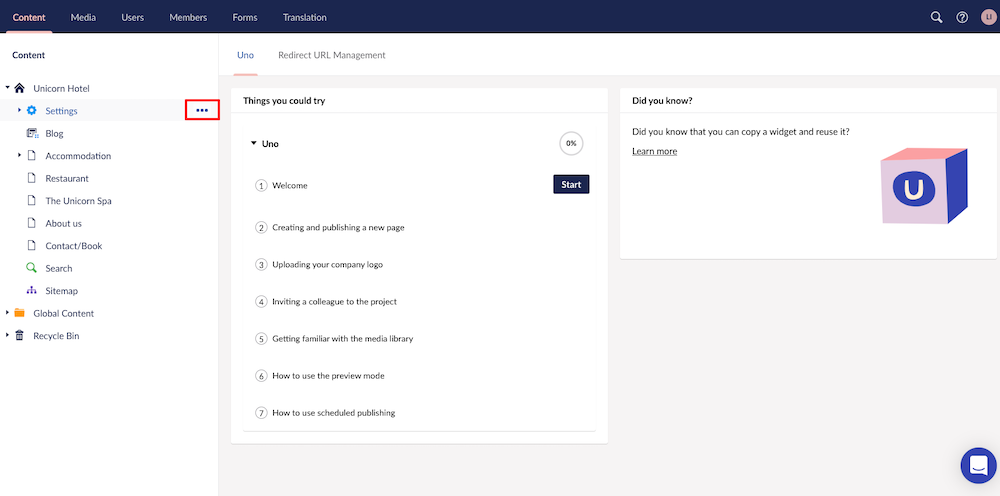

# Manual redirect settings in Uno

If you have ever changed the name - and thereby the URL - of a page, you might have noticed that you are automatically redirected to the new page. This is a built-in feature in Umbraco Uno. If you want to add your own custom redirects this is also possible.

The settings to add manual redirects are not automatically created for you with your new project, so the first step in getting started is to set it up. After it is set up you can start adding manual redirects to your site.

## Adding the manual redirects settings

1. In the **Content** section, expand the home page (in this case that would be ***Unicorn Hotel***)
2. Now select the ellipses next to **Settings** to create a new item

    

3. Select **Manual Redirects**
4. Give the new settings a name - In our example we will call it **Manual Redirects**
    * The name will only be visible in the backoffice so pick a name that is relevant
5. Click *Save and publish*

Now you have created a new section for manual redircts and you can start creating manual redirects.

## Creating a manual redirect

1. Click on the ellipses next to the newly created settings sectiob - **Manual Redirects**
2. Select **Redirect**
3. Give the redirect a name - This will only be visible in the backoffice so pick a name that is relevant
4. Choose the URL to **Redirect From** - This field **must** be the absolute URL of the page (ie. `https://domain.com/the-old-url/`)
5. Choose where on your site to **Redirect To** - This field works as a content picker and lets you navigate to the content page that you want to redirect to.
6. (Optional) Give the redirect a **Description** - can be helpful to remember why you added this redirect
7. Click Save and publish

Your redirect is now live and any visitor trying to access the URL you chose in **Redirect From** will be sent to the page you picked in **Redirect To**. The redirect is added as a *301 Moved Permanently* redirect.

If you made a mistake or wish to delete a redirect you can do so by following these steps:

1. Click on the **Manual Redirects** settings you have created
2. From the list, select on the redirect you want to delete by clicking on the left-most icon
3. Click **Delete** in the top right corner of your screen
4. Confirm that you want to delete it

Now the redirect is deleted and the old URL can again be accessed by users.

:::note
Beware that redirects are normally cached in browsers. A user who has the redirect in their browser cache will still be redirected even though it has been deleted by you. The only way for that user to access the page that was **redirected from** is to empty their browser cache.
:::
