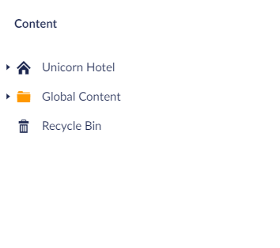

# The Global Content

Global Content is a way for you to create widgets that you will then later be able to use on other pages via the [Global Content Widget](../../Widgets/Global-Content).

When you have created a widget here it will work as a template in the future, so that you will only have to set it up once, saving you a lot of time in the future.

Setting your widgets up with this feature ensures that every time you make a new page, you can get the same design on each page.
All you will need to do is add them in the Global Content widget, making it straight forward to keep the same design on all of your pages.

## Setting up Global Content

- From the Content tree on the left, hover over Content
- Then click the `...` and select *Global Content Holder* - this will serve as a folder for your Global Content
- Name the folder anything that makes sense to your setup
- Then hover the folder, and click the `...`
- Here you will have two options: the first one is Global Content, the second one is the Global Content Holder

- Pick the one you want

### Global Content

If you Selected Global Content, follow these steps to create widgets:

- When you press **Add Content** a window will pop up where you can select what widget you want to work with (you can select multiple widgets)
- Select and configure the widget(s) you want to use
- You set them up like you would do normally, the only difference here is that they will be marked as Global Content

Doing this, you will now have a set of pre-setup widgets, which you can then use on multiple pages of your site.

Learn more about how to use the Global Content on your pages in the section about the [Global Content Widget](../../Widgets/Global-Content).

### Global Content Holder

Now for your second option regarding Global Content, which is the Global Content Holder. This gives you the option to create another folder, if you want to structure your Global Content further.
This is the Global Content Holder, which gives you the option to create a folder. Think of this as a way of storing your Global content.

You can even choose to make another folder within your folder.
