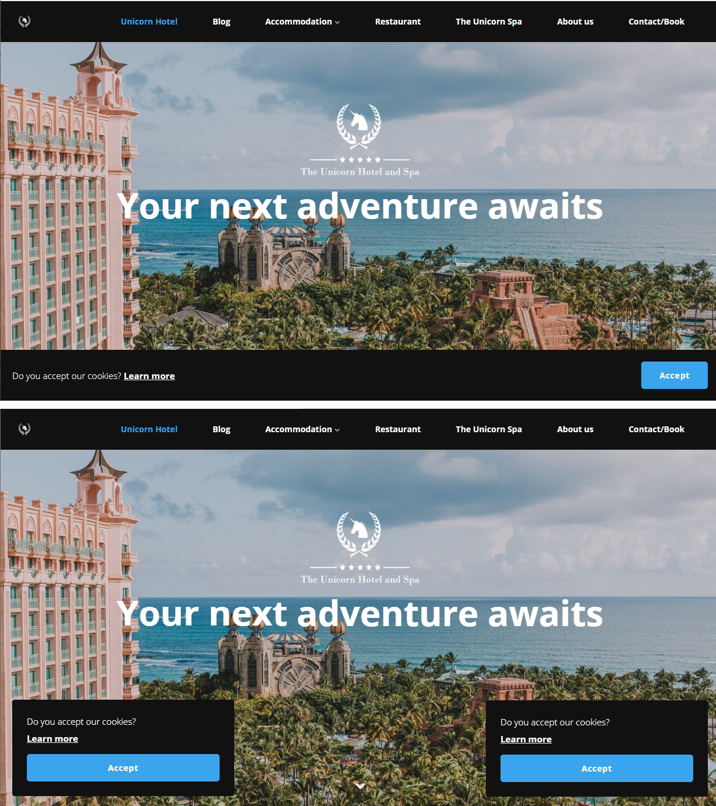

# General Settings

As a child page under *Settings* you'll find *General*. Here you will find a long list of settings and configuration options for your website. The general settings will apply to the entire website.

In this article you can learn more about the various options as well as get an idea of what the settings will affect.

The General settings are divided into 6 different groups:

* [General](#general)
* [Newsletter](#newsletter)
* [Instagram](#instagram)
* [Cookie Consent](#cookie-consent)
* [Search](#search)
* [Tracking and Access](#tracking-and-access)

## General

A set of different configuration options.

### Title Signature

Optional text that will be added to title on all pages on your website. E.g. if the pagename is *Start* and your Title Signature is " - by Umbraco", the full title of the page will be "*Start - by Umbraco*".

### Twitter Username

Fill in your Twitter handle, which will be used ...

### Contact Form Email and Contact Form Subject

When using the *Content Form* widget, you can use these to define the email that should receive the forms submissions and the subject of the mails sent to that receiver.

## Newsletter

When you have a Newsletter service setup using either MailChimp or Campaign Monitor, make sure to configure it here. It will enable you to use the *Newsletter* widget.

### Email Marketing Provider

Choose your provider from a dropdown list.

Currently we support [MailChimp](https://mailchimp.com/) and [Campaign Monitor](https://www.campaignmonitor.com/).

### API Key

In order for your website to connect with the external, you will need to add in your API key.

### Default Subscriber List ID

In order to choose which list your users will be subscribing to from your website, set the List ID here.

## Instagram

In order to use the *Instagram Feed* widget, you will need to configure the following settings:

### Username

Your Instagram username, without `@`.

### User ID (optional)

Your Instragram User ID.

### Access Token (required)

You will need to add your access token as well, in order for your Umbraco Uno project to connect to your Instagram profile.

In order to generate an access token you will need to create a Facebook app and add your Instagram account as a test user.

This can all be done by following steps 1-3 in the [Facebook Basic Display API Guide](https://developers.facebook.com/docs/instagram-basic-display-api/getting-started).

## Cookie Consent

Your website already has a built-in cookie consent template set up. In this group of properties, you can manage the contents and decide whether you want to enable it on your website.

### Enable Cookie Consent Dialog

When this is checked, the cookie consent dialog will be shown on you website for all new visitors.

### Text

What the cookie consent dialog says is entirely up to you. We recommmend mentioned all cookies you've setup yourself, including the once that ships with Umbraco Cloud.

### Learn More Link

Adds a link to the cookie consent dialog, which the customer can follow to learn more about your cookies policies. You can choose to add an external/internal URL or choose an existing page from your website.

### Dismiss Button Text

Define what the text on the *dismiss button* should say.

### Theme

The cookie consent dialog comes with the pre-defined themes: One with black background, and one with white background.

### Position

You can choose between three different layouts for the cookie consent dialog:

* A box that floats in the bottom-left of your website (`float-left`)
* A box that floats in the bottom-right of your website (`float-right`)
* A full-width banner at the bottom of your website (`banner-bottom`)

## Search

The Search group has only a single configuration option where you can decide to show search results in a grid. With this view, the search results will include the SEO image set on the pages found.

The default search view is a traditional list view.

## Tracking and Access

As the final group on the General settings, you can connect your Google tools with the website. The tools you can connect through here is **Google Analytics**, **Google Tag Manager** and **Google Maps**.

None of these are required, but we do recommend adding a Google Maps API Key, as they will enable you to use the *Map* widget.

You can also enable comments by adding your **Disqus** shortname. Learn more about this works on [the official Disqus documentation](https://help.disqus.com/en/articles/1717111-what-s-a-shortname).
