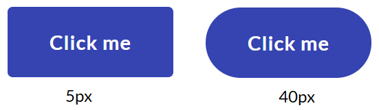

# Theme Settings

As a child node under *Settings* you'll find the *Theme* node. Here you will find a long list of settings and configuration options for your website. The theme settings will apply to the entire website.

Most of the options found here, are also available through the [Theme Editor](../../../Getting-Started/Themes).

In this article you can learn more about the various options as well as get an idea of what the settings will affect.

The general settings node is divided into 7 different groups:

* [General](#general)
* [Colors](#colors)
* [Header](#header)
* [Footer](#footer)
* [Grid](#grid)

## General

In this group you will find options to upload and set your company logo for various use cases, define the default fonts and a few options to costumize the buttons on your website.

### Logo on Dark and Logo on Light

These give you the option to upload two versions of your company logo - one that works best on a dark background and one that works best on a light/white background.

The logo will mainly be used in the website header and act as a link to your frontpage.

### Favicon

Upload a square image in `.png` format, that will be used as the website favicon

### App Icon

Upload a square image, preferably with a background color. The App Icon is used when the website is added to the homescreen of an iPhone.

### Icon Background Color

In some cases your facivon will be shown with a background color. This setting lets you configure the exact color that should be used as background with the image you uploaded to be used as favicon.

The color needs to be in [HEX value](https://htmlcolorcodes.com/).

### Embed Font

This setting lets you load in webfonts from e.g. [Google Fonts](https://fonts.google.com/). The default font is `Roboto`.

You can load in as many fonts as you would like. Keep in mind that loading in too many different fonts might affect the site performance.

### Body Font

Define the font used for all text on the website that isn't defined as a heading.

### Heading Font

Define the font used for all headings on the website.

### Button Border Radius

Define how rounded the borders on your buttons should be. The lower the value, the more square your buttons will be.

### "To Top"-button color

When you start to scroll down on any page on the website, there will be a button visible to help you jump back to the top of the page.

You can customize the button to be either black, white or the custom theme color you've define.

## Colors

In this group you have the option to custmize the colors used around the website. This provides the option to match the website to your company colors and identity.

### Theme

This is the main color on the website. It can be used for buttons, backgrounds, link color and other design elements.

### Theme Contrast

The color that will be used for text elements placed together with the Theme color.

### Heading Dark and Text Dark

Define the color for headings and text placed on light backgrounds (white or gray). Choose a darker color for the best results.

### Heading Light and Text Light

Define the color for headings and text placed on dark backgrounds. Choose a lighter color for the best results.

### Gray and Dark Background

The option to make the gray and dark backgrounds the colors that best fit your company identity.

### Selected Navigation Item

Define the color of selected item in the naviation bar on your website. By default this will be set as the default Theme color.

## Header

This group contains configuration options for the header of your website, hich by default contains your company logo/name, the main navigation menu, search functionality and the option to change language if you've set this up.

### Header Theme

For the header background you can choose either dark or light.

### Header Layout

You can choose between 4 different layouts for the Header of your website.

### Container Width

Define the width of the container inside of the header which will always be the full width of the screen size.

### Height

Define the height of the header in pixels.

### Height Mobile

Define the height of the header when your websites is view on mobile.

### Logo Padding and Logo Padding Mobile

Define the padding (in pixels) over and under the logo.

### Navigation Padding and Navigation Padding Smaller Screens

Define the padding (in pixels) around each of the navigation items.

## Footer

In this group you get a couple of configuration options to customize the look of the footer in the very bottom of your website.

### Footer Theme

For the footer background you can choose either dark or light.

### Container Width (Footer)

Define the width of the container inside of the footer which will always be the full width of the screen size.

## Grid

In this group you can custmize the dimensions of the *Grid* widget.

### Container Width (Grid)

Define the width (in pixels) of the container holding the grid widget. It's possible to define 3 sizes: Small, regular and big.

### Grid Gutter

The *Grid Gutter* is the space between columns when working with the *Grid* widget.

You can specify the amount of pixels between each column for 4 different screen sizes: Large (default), Medium, Small and XS.
