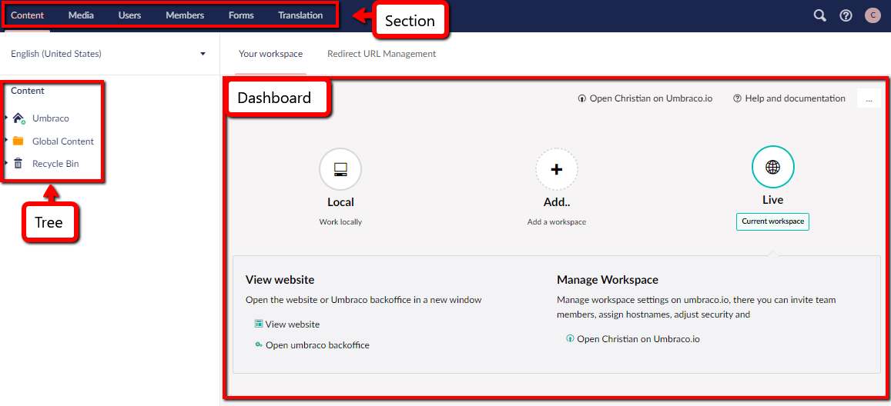

# The Umbraco Backoffice

This is an article about the backoffice, and is designed around giving you a deeper understanding of what the backoffice is.

## What is a Backoffice

The Backoffice is the counterpart to the Frontend. It is in the backoffice that you create all of your content, which is done in the Content section of the backoffice.

The backoffice is built of multiple areas. There's the Section Tree on the left, the Dashboard/workspace in the middle, and the Sections menu at the top. To learn more please read [the Getting started guide for the backoffice](../../../Getting-Started/Backoffice/index.md). The backoffice also lets you control what your users can do and you can change settings for your users and members.

Essentially the backoffice works as your main workspace when creating and managing things in your Umbraco Uno project.

### Section Tree

The tree is a list of multiple items, it could be media items or content items. The tree is always located to the left of the Dashboard.

### Page

A page is an item in the tree list. What a page is changes depending on what section you are in. For example, in the Content section a page would be a piece of content or a page, and in media, it would be an image or a folder.

### Dashboards/Workspaces

The dashboard is located in the middle of the screen for each of the sections. The main function of the dashboard is to show you important information.

It is worth noting that the dashboard will be transformed into your workspace when working with content and media.

To switch between workspace and dashboard you can select pages for workspace and the top of the Section tree for Dashboards.

## The Sections

The backoffice is divided into sections you will see this in a menu bar in the top of the page. The sections are as follows:

- [Content](#content)
- [Media](#media)
- [Users](#users)
- [Members](#members)
- [Forms](#forms)
- [Translation](#translation)

Here we will get in-depth with what each section offers you in tools.
You will do the majority of your work from the Content sections, however, some tools may only be used on certain sections such as creating a new form for instance.

### What it looks like

### Content

The Content section is where you work with your content. It utilizes a Content Tree which can be found on the left side of the screen. The Content Tree is built from your pages. These pages are items in your tree and in most cases, pages on your website.

### Media

The media section is where you can handle all of your images and videos. The way it works is that you can create a folder for your media files if you want, by pressing the button in the left top of the dashboard that says “Create”.

When you have created a folder, you can open the folder and then you drag the images from your local machine into the folder, and it' in your media library. On the left side of the screen, you can see your entire Media Library.

There is much more to learn about [Media](../../Creating-Content/Manage-Media-library).

### Users

The Users section handles all of the backoffice users that have been invited to the backoffice. Here you can change what permissions the users have such as read-only users.
What sections they should have access to is also up to you, and you can choose that by creating a group for the users that only have access to the sections you want them to.

You can get deeper knowledge about how to manage Users in the [Users](../../Manage-users) article.

### Members

The Members section handles members which are not to be confused with users. Members are people that sign up to your site via a register form on the frontend. This means that the members are your “customers” and users are your “workers”. You can choose to create members manually as well. 

From the members section you will be able to fix their passwords or what other management tasks might be needed there.

If you want to learn more about Members and how to manage them, see the [Members](../../Manage-users) article.

### Forms

The Umbraco Forms Forms section lets you create forms to use in your content section. You can read more about Umbraco Forms and how to create them in the official [Umbraco Forms Documentation](../../../Add-ons/UmbracoForms).

### Translation

In this section you can add text to some of the more static elements on the website.

This could be tooltips for when things are hovered over and it could be more static button texts like "Login" and "Register".
