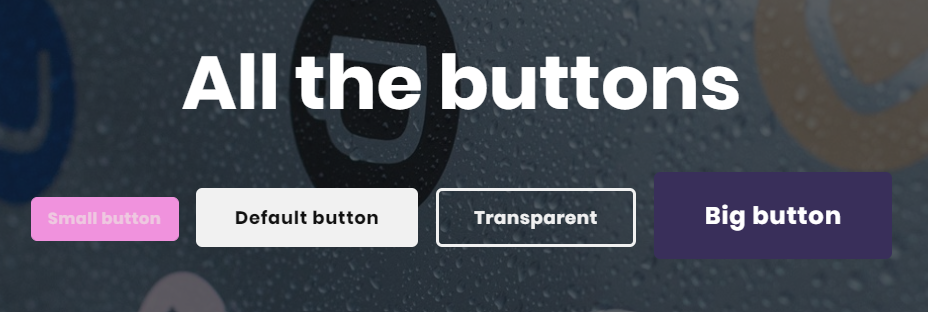
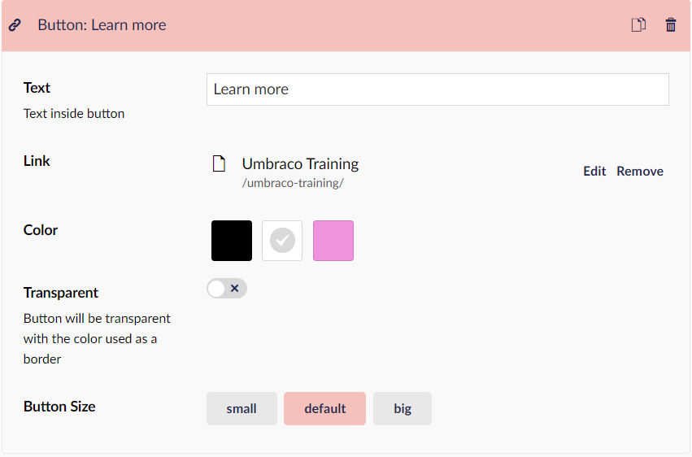

# Buttons

Several of the widgets available with Umbraco Uno provides the option to add buttons along with the other content available in those widgets.

Buttons can customized to match the general layout and theme of the website and they can be setup to either link to any internal page on the website or to an external website.

## Samples

## Configuration options

* Text
* Link (external or internal)
* Color (dark, light or theme color)
* Transparency
* Button size (small, default or big)

