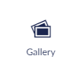
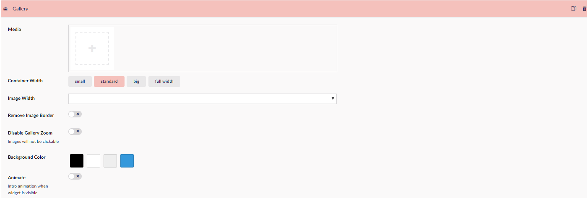

# Gallery (media)

The Gallery Widget allows you to display multiple images in a gallery view, meaning that the images will be aligned in rows.

This also contains the feature to click on images to zoom in on the images. This feature can be disabled.

You will be able to change the setup of your gallery. This could be the size of the images or the background color of the whole container.

You can click the image to zoom in, where you can browse through the images in the gallery by using the arrows next to the images or use the arrow keys on the keyboard.

Below you can see how the gallery would look with image width at 20%, and a blue background color.

## Sample

## Configuration options

- Media
- Container Width
- Image Width
- Remove Image Boarder
- Disable Gallery Zoom
- Background Color
- Animate

