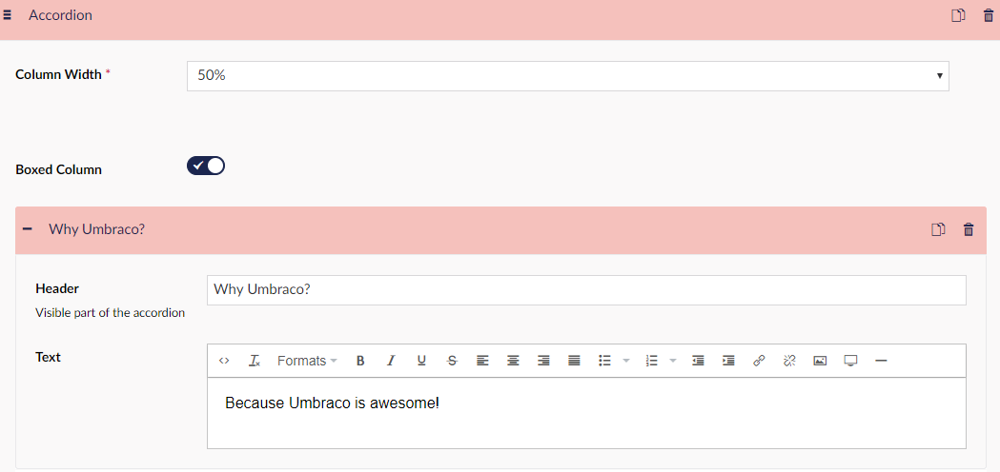

# Accordion

This lets you create multiple boxes containing a header and an arrow down, which lets you expand the box to reveal more information, usually related to the header. This could be used if you had a subject in the header and then unfold the subject to get further information.

## Sample

 

## Configuration options

- Column Width
- Boxed Column

In the separate Accorcions you have the following options:

- Header
- Text

