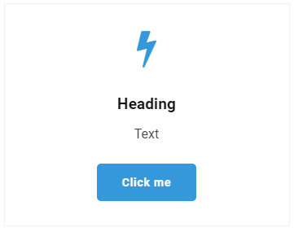

# Pod

The Pod will allow you to create a container of content, containing a header, text, an icon, and a button.
You can also add a link and a background image.

## Sample

## Configuration options

- Column Width
- Heading
- Text
- Boxed Column
- Center Content
- Icon
- Image
- Pod Media Left - This will allow you to let the image and icon float to the left of your text.
- Link
- Button

