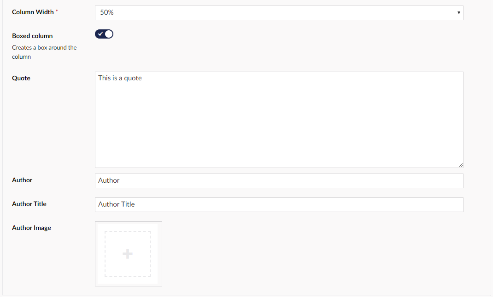

# Quote

Quote, lets you add a piece of text that will then be placed between `""`.  You can add the author of the quote and their title as well as an image of the author.

## Sample

## Configuration options

- Column Width (This is mandatory because it decides how large the column containing Quote is)

- Boxed Column (This switch adds a box around the entire Quote columns width)

- Quote (This is where you add the quote itself)

- Author (In this field you can write the name of the author that you are quoting)

- Author Title (In this field you can add the title of the author)

- Author Image (This lets you upload an image of the author you are quoting)

