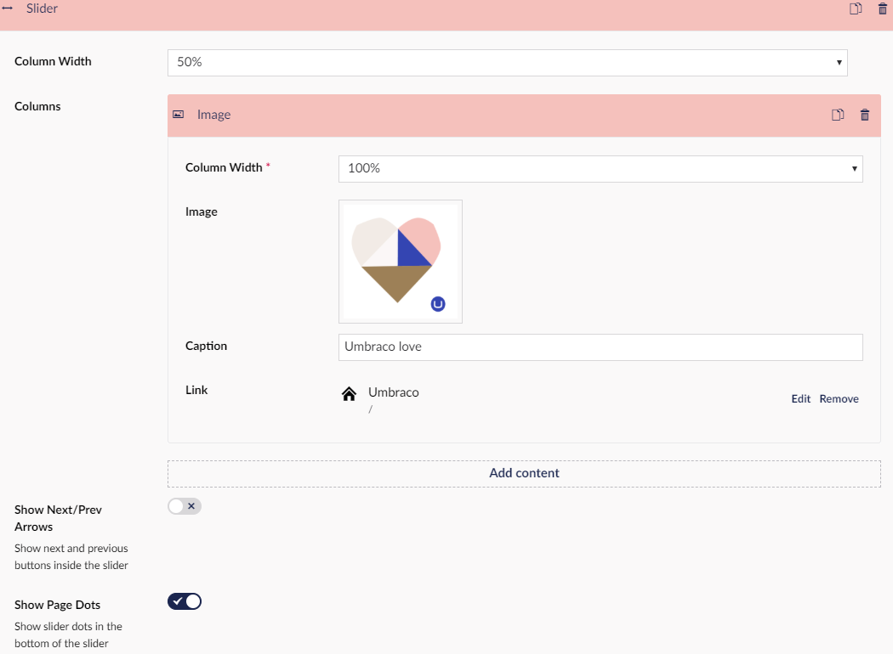
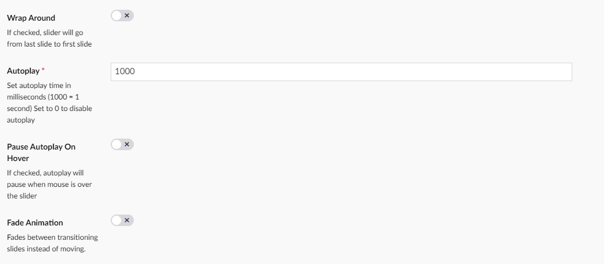

# Slider

The slider slides through your selected content. It can be very visually pleasing to have it go through images.
By clicking this link you can find more information on how the [Slider](../../slider/index.md) widget works in general

## Sample

## Configuration options

- Column Width - The slider is one of the only grid widgets that do dont require you to fill out Column Width.
- Columns - This is where you pick what each slide contains.
- Show Next/Prev Arrows
- Show Page Dots
- Wrap Around
- Autoplay - it is required to fill this out, 1000 = 1 sec
- Image
- Pause Autoplay On Hover - This stops the slider from sliding to the next slide as long as you hover the cursor over the slider.
- Fade Animation - When this is on your slides will fade into the next one instead of sliding.

