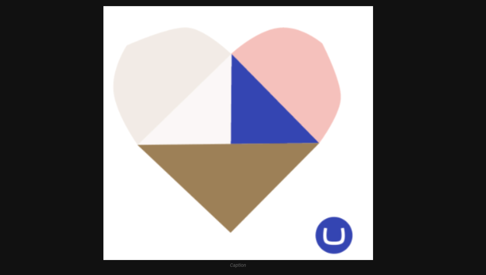
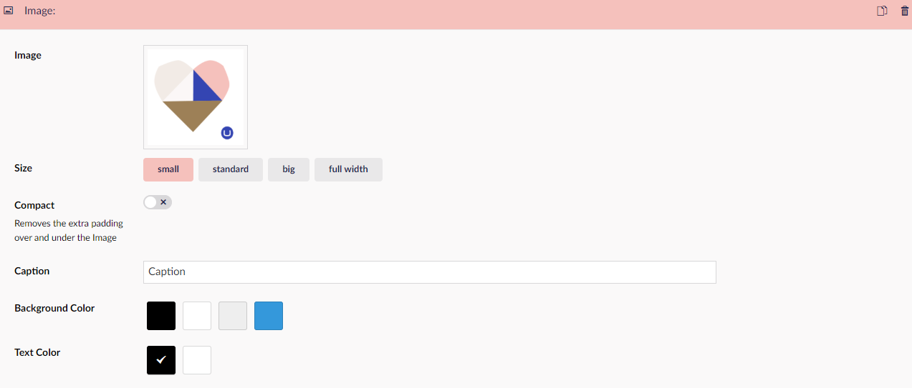

# Image (single)

This Widget allows you to add an image to your site, select the size of the image, Caption The image and select the background and text color.

This is like the ***Text Widget*** good if you want an image outside of any of the other Widgets that contain the ability to add images.

## Sample

## Configuration Options

- Image
- Size
- Compact
- Caption
- Background Color
- Text Color

