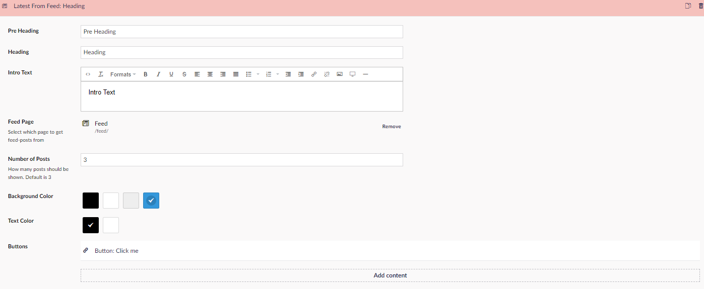

# Latest from feed

The Latest From Feed Widget, is used to show posts from a ***Feed*** that you already have on your website. ***Feed*** here referring to the ***Feed*** content type.

## Sample

## Configuation Options

- Pre Header - text above the Heading.
- Heading
- Intro box, lets you give the reader a short intro text to what the articles in the feed is about.
- Feed Page, where you pick which feed you want displayed
- Number Of Posts, gives you the option to select the amount of posts the widget will show
- Background Color
- Text Color
- Buttons

