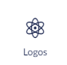
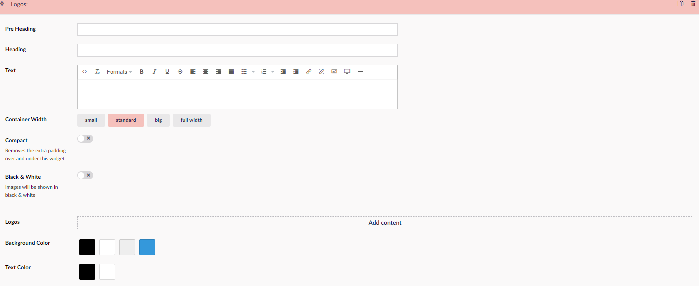
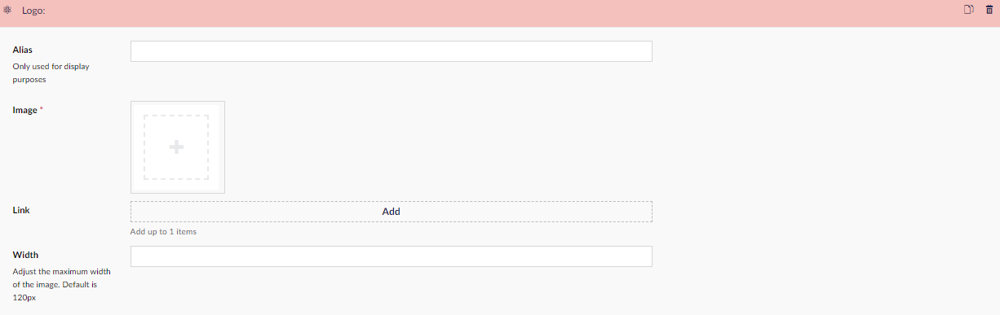

# Logos

The Logos Widget does what the name implies, and lets you add a set of logos to your website.
You can choose what images you will use for logos, and what pages they need to link to and/or you can add text to it.

The configuration for this widget is divided into two parts:

## Sample

## Configuration Options

- Pre Heading
- Heading
- Text
- Container Width
- Compact (removes the extra padding over and under this widget)
- Black & White (images will be shown in black & white)
- Add content (you need to do this to get the second section)
- Background Color
- Text Color

Part two is for adding logo and settings for these. For each logo you want to add, you have the following options:

- Alias (the name of the logos)
- Image
- Link (links the logo to another page on your site or a different site)
- Width

