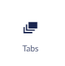

# Tabs

The Tabs Widget allows you to create tabs like the ones you find in your browser. Each tab can contain any widgets you desire.
You can even add multiple widgets within one ***Tabs Widget***. This means you could have the ***Text Widget*** and the ***Image Widget*** on one tab and a ***Forms Widget*** on another tab.

## Samples

## Configuration options

- Theme Color

