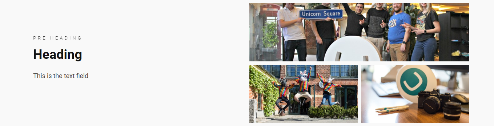
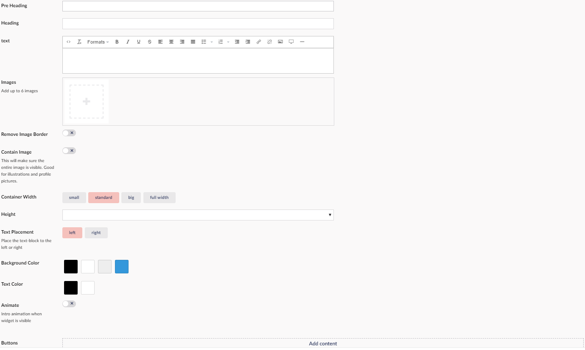

# Text and images

This Widget allows you to create a collage of images and text.
You can have ***six*** images in total, You can add a ***Pre Heading*** and a ***Heading*** to it.

## Sample

## Configuration Options

- Pre Heading
- Heading
- Text
- Images
- Remove Image Borders
- Contain Image
- Container Width
- Height
- Text Placement
- Background Color
- Text Color
- Animate
- Buttons

