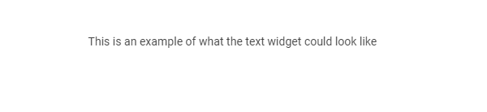
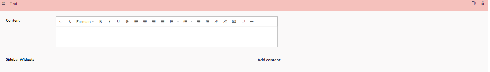

# Text widget

The Text Widget lets you create a text field on the page. The widget contains a Rich text editor and the option for adding sidebar widgets, which can be text areas, links and/or buttons. These are explained in more detail in the [Sidebar widgets](../Sidebar-widgets) article.

This widget is useful if you only need to add a text box. Most of the other widgets come with an option to add text as well.

## Sample

## Configuration options

- Content (Rich Text Editor)
- Sidebar widgets

::: Note
The Text widget is the *standard* width per default. This cannot be changed.
:::
