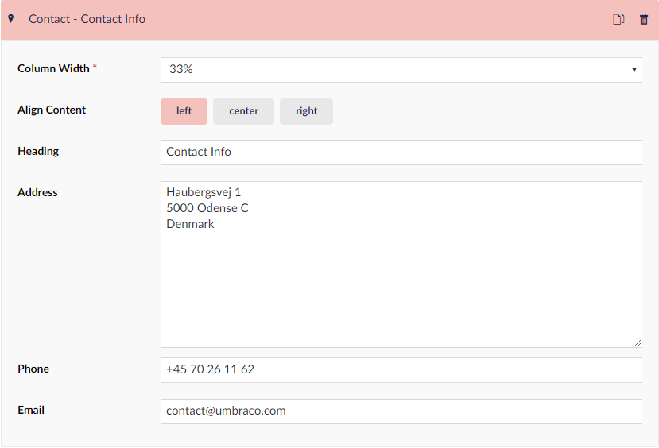

# Contact (widget)

The Contact widget is a smaller version of the [Map widget](../Map) and it is only available in the footer section of the website, which can be setup from the **Start** page.

Aside from an address, it is also possible to add a phone number and an email address, which will both be presented as clickable elements on the frontend, allowing visitors to quickly get in contact.

## Sample

## Configuration options

### Footer options

* Column width (mandatory)
* Align content
* Heading

### Contact options

* Address
* Phone
* Email
