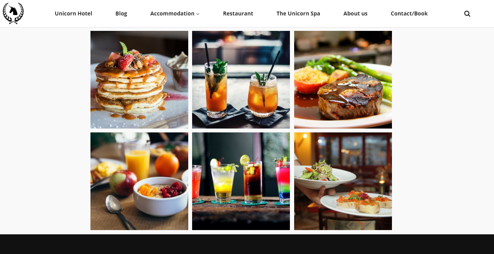
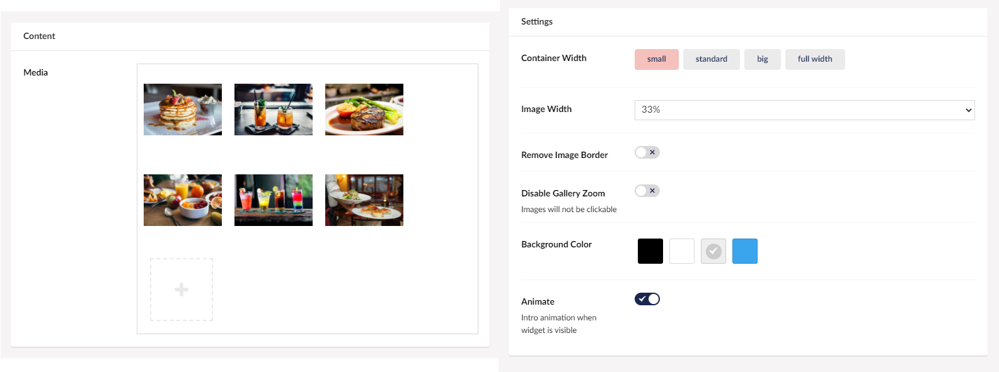

# Gallery (media)

The Gallery widget allows you to display multiple images in a gallery view. This also contains the feature to click on images to zoom in on the images. This feature can be disabled if needed.

You will be able to change the setup of your gallery, like the size of the images or the background color of the whole gallery.

You can click the image to zoom in, where you can browse through the images in the gallery by using the arrows next to the images or use the arrow keys on your keyboard.

## Sample

Below you can see how the gallery would look with image width at 20%, and a grey background color.

## Configuration options

Below is an overview of the configuration used on the gallery in the sample.

### Content

- Media

### Settings

- Container Width
- Image Width (same size for all images in the gallery)
- Remove Image Boarder
- Disable Gallery Zoom
- Background Color
- Animate
