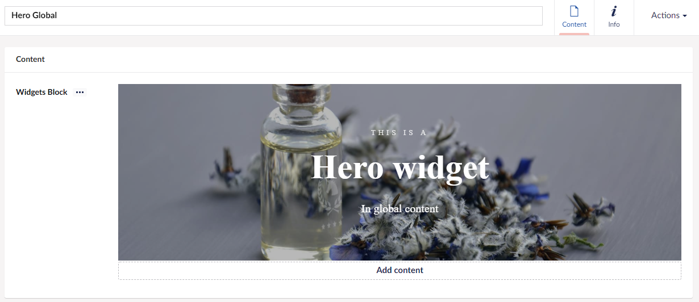
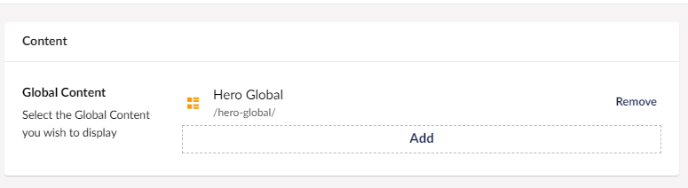

# Global Content

What this widget does for you, is that it allows you to pick pre-made widgets, also called Global Content.

To learn more about how to create Global Content, you can read the [Global Content](../../Uno-pedia/Content-Types/Global-Content/index.md) article.

Once you've added the Global Content Widget to your page, follow these steps to select which Global Content you want to use:

- Click "Add"
- From the dialog in the right-hand side, expand the folder containing your Global Content (click the arrow next to it)
- Finally, select which of your pre-made widgets you want to add to your page

Keep in mind that in order for there to be anything to select, you will have to have set-up some widgets using the [Global Content](../../Uno-pedia/Content-Types/Global-Content/index.md) feature.

This is a very useful tool if you have a widget that you use a lot and want to look the same on multiple pages.

See below an example, of what it might look like. In this example, there is a Hero Widget which have been created as Global Content and can therefore by selected with The Global Content Widget.

## Sample

## Configuration Options

The global widget is a way to set up templates for the design so you wont have to set up the widgets for each page. That is why the global content it self doesn't have any options for settings, because you will be configuring the settings for each widget you add to the global content.

:::Note
Please be aware that you will not be able to see the preview for this in the backoffice.
:::
