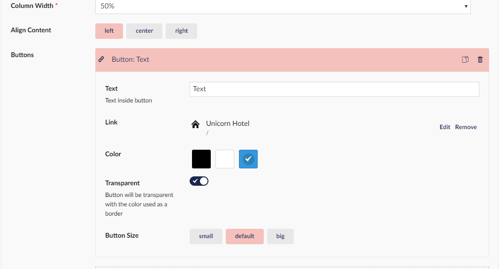

# Button

The button lets you as the name implies, create buttons. The way the buttons work is that you choose an alignment for the button.
Then pick how you want it to look, and finally you link the button to something either on your website or on an external site.

By clicking this link you can find more information on how the [Button](../../Buttons/index.md) widget works in general

## Sample

## Configuration options

- Column Width (This is mandatory because it decides how large the column containing the Price list is)

- Align content (This lets you choose if the button should be left, center or right aligned in the column)

- Buttons (This is where you create your buttons by setting up the options as you want them)

The options in Buttons are:

- Text (This lets you add the text you want to your button)

- Link (What the button should link to)

- Color (What color you want your button to be)

- Transparent (If you switch this on your button will be transparent)

- Button Size (This lets you decide how big you want your button)

:::Note
Please be aware that this is only for buttons in the grid widget.
:::