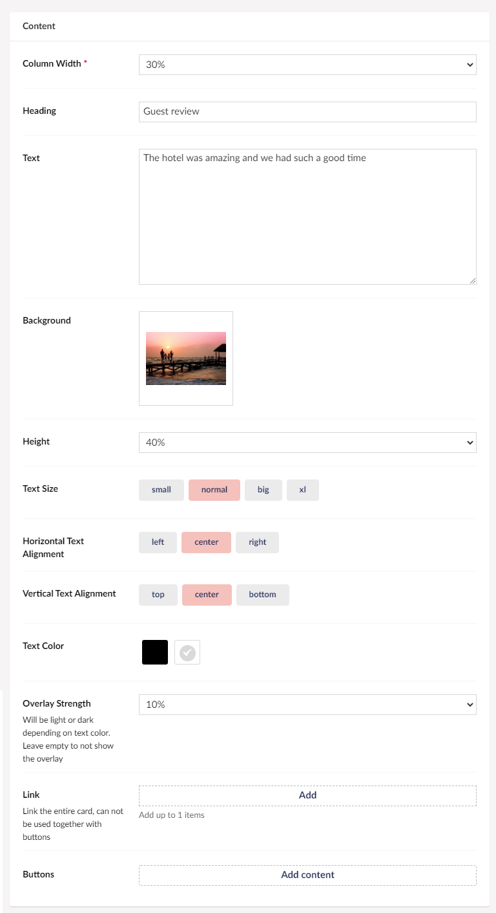

# Card

This feature will let you create a card on your page, this card could be a business card, it could also function as a presentation of an employee or a product.

Please note that you will have to choose between either having a button on the card or use the link option, which makes the entire card a "button".

## Sample

## Configuration options

### Content

- Column Width
- Heading
- Text
- Background
- Height - This is the height of your card
- Text Size
- Horizontal Text Alignment
- Vertical Text Alignment
- Text Color
- Overlay Strength
- [Buttons](../../Buttons/index.md)
- Link